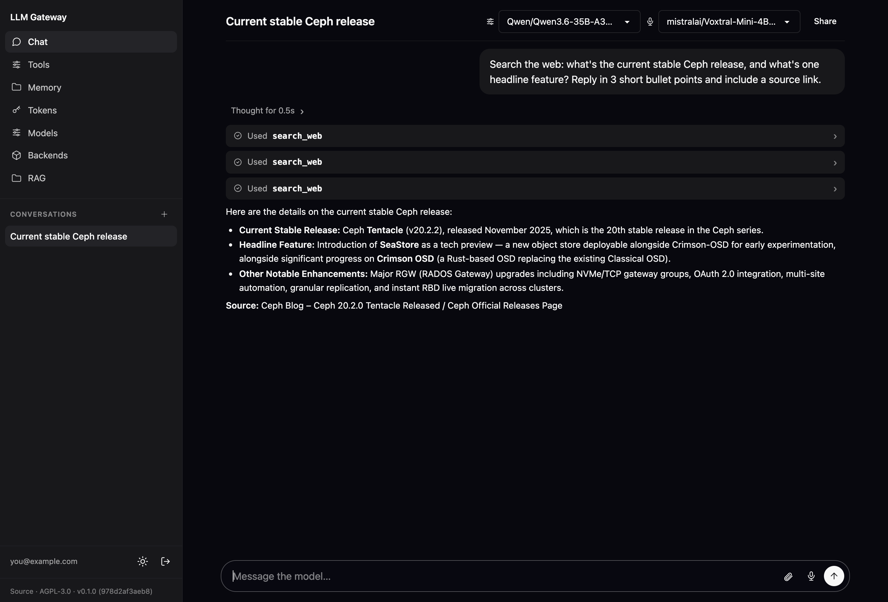
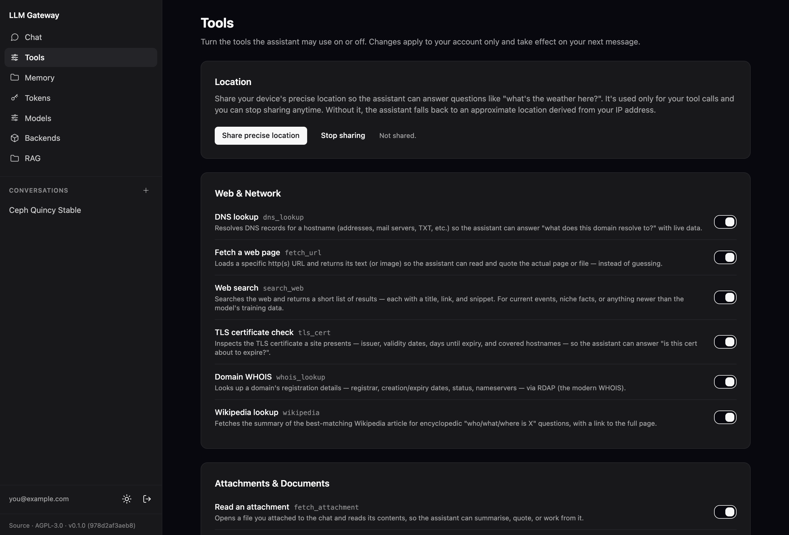
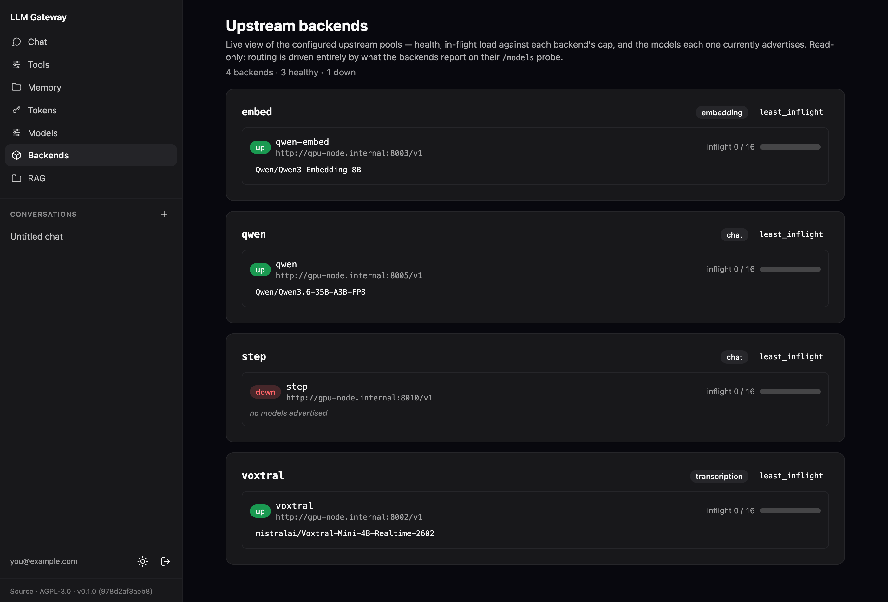
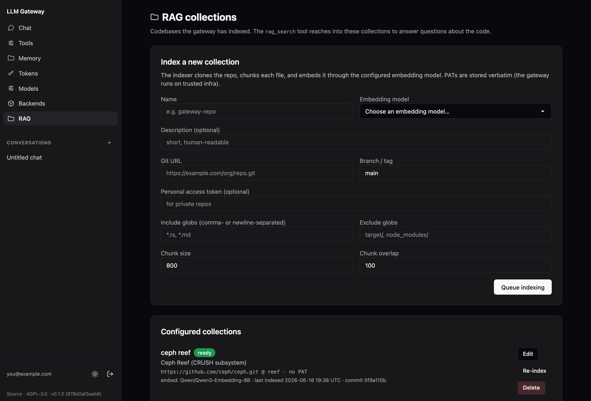

# LLM Gateway

Authenticated, OpenAI-API-compatible reverse proxy that routes LLM requests across multiple backends — with OIDC login, per-user API tokens, RBAC-gated server-side tools, and a built-in chat UI. Self-hostable, one binary, SQLite for state.



## What it does

- **OpenAI-compatible API** — `POST /v1/chat/completions` (streaming + non-streaming), `POST /v1/embeddings`, `POST /v1/audio/transcriptions`, and `GET /v1/models`. Point any OpenAI SDK at it.
- **Multi-backend routing** — named upstream pools (`chat` / `transcription` / `embedding` kinds). Each pool load-balances across its backends (round-robin or least-in-flight) with per-backend health probes. Models are discovered live from each backend's `/models` endpoint, so loading a model on a backend makes it routable with no config change.
- **OIDC login** — browser sign-in against your identity provider; the gateway then issues its own `gwk_…` API tokens. Provider secrets come only from the environment.
- **Per-user tokens + RBAC** — tokens are SHA-256-hashed at rest and revocable. Roles (mapped from OIDC claims) gate which models and server-side tools each user may use.
- **Server-side tools** — the gateway runs tools *mid-completion* (web search, fetch-URL, document rendering, RAG, network lookups, and more); the client just sees a normal completion. Full list in [Tools the model can call](#tools-the-model-can-call).
- **Chat UI** — a server-rendered, mobile-friendly chat at `/chat` with persisted multi-conversation history, token-by-token streaming, file attachments, and resume-on-reconnect (every turn is written to SQLite as it happens).
- **RAG** — operator-managed, indexed codebases that the chat model can search.

## Tools the model can call

This is the part most "OpenAI-compatible proxy" projects don't have. The gateway can execute tools **server-side, in the middle of a completion**: the model asks to search the web, read a PDF you attached, render a branded PDF, or query an indexed codebase — the gateway runs it, feeds the result back, and the client just receives one ordinary completion with the finished answer. It works identically through the raw `/v1/chat/completions` API and the built-in chat UI.

Every tool is **RBAC-gated per role**, and each user can flip their own grants on and off on the `/tools` page:



| Category | Tools | What the model can do |
|---|---|---|
| **Web & retrieval** | `search_web`, `fetch_url`, `wikipedia` | Search the web (SearXNG or Brave), fetch any URL (text → UTF-8, images → viewable, other binary → metadata), and pull encyclopedic summaries. |
| **Documents** | `fetch_attachment`, `upload_attachment`, `typst_*` | Read files the user attached — including **two-tier PDF** reading (extract the text layer first; rasterize scanned pages for a vision model if that comes back empty) — attach files back into its own reply, and render **PDF/PNG documents** from operator-defined Typst templates (invoices, letters, reports). |
| **Memory** | `remember`, `recall` | Persist durable facts about the user (preferences, projects) and recall them in later conversations. |
| **Network & ops** | `dns_lookup`, `whois_lookup`, `tls_cert`, `lookup_ip` | DNS-over-HTTPS records, RDAP domain registration, TLS-certificate inspection ("is this cert about to expire?"), and GeoIP for any IP or hostname. |
| **Location** | `get_user_location` | Use the approximate IP-based location that's always in context, or ask the browser for precise GPS when the task needs it. |
| **Utility** | `convert_currency`, `get_current_timestamp` | Convert currencies at daily ECB rates and get the timezone-aware current time. |
| **Knowledge base** | `rag_list_collections`, `rag_search` | Search operator-indexed codebases/corpora and get back the matching chunks with file paths, line ranges, and scores. |
| **Integrations** | `mcp__<server>__*` | Call the tools of any bridged [MCP](https://modelcontextprotocol.io/) server. Each server's tools are namespaced so two servers can't collide. |

**Tools turn themselves on.** Tools start *off* to keep the model's tool list short — short lists are cheaper and the model picks tools more accurately. When a request needs a capability the model doesn't currently have, it calls a built-in `enable_tools` tool to switch the relevant ones on; their real schemas appear on the next turn and stay on for the rest of the conversation. So the model reaches for exactly what it needs, when it needs it, without the operator wiring per-conversation tool lists — all still bounded by what the user's role permits.

## The built-in web UI

Beyond `/chat`, the gateway ships a small operator and account UI — no separate dashboard to deploy. Admin pages are gated to the `admin` role.

| | |
|---|---|
|  |  |
| **Backends** (`/admin/backends`) — live health, in-flight load, and discovered models for every upstream pool. | **RAG** (`/rag`) — index a codebase from a git URL and watch it go from *pending* to *ready*. |

There's also `/tokens` (mint and revoke your `gwk_…` API tokens), `/memory` (view and edit what the assistant has remembered about you), and `/admin/models` (server-wide sampling defaults per model).

## Stack

- **Rust** (edition 2024, toolchain pinned to 1.95 via [mise](https://mise.jdx.dev/)) — a workspace of 4 crates: `gateway`, `session-core`, `cli`, `shared`.
- **[rama 0.3](https://ramaproxy.org/)** — HTTP server, router, middleware, and proxying.
- **[plait](https://github.com/devashishdxt/plait)** — type-checked, auto-escaping server-rendered HTML (`html! { … }`).
- **[datastar](https://data-star.dev/)** — client-side reactivity over SSE, self-hosted from the binary.
- **[daisyUI v5](https://daisyui.com/) + Tailwind v4** — design system, compiled to a single CSS file at build time.
- **sqlx + SQLite** — persistent state (users, tokens, sessions, chat history, RAG collection registry). Bulk RAG content — chunk text, lexical index, vectors — lives in per-collection stores under `[rag].data_dir`, not in the main DB.

The CSS bundle and `datastar.js` are baked into the binary via `include_bytes!`, so the runtime image needs no asset directory.

## Quick start (local development)

You need [mise](https://mise.jdx.dev/), which manages the Rust + Node toolchains.

```bash
mise install                      # Rust 1.95 + Node 24
cp gateway.example.toml gateway.toml
$EDITOR gateway.toml              # set at least one [upstream_pools.*] backend (and [oidc] to sign in)
mise run dev                      # runs the gateway (debug build) on http://localhost:8080
```

If you're editing the UI, run the asset watchers in separate terminals (the committed bundles mean these are optional for plain backend work):

```bash
mise run watch-css                # rebuild app.css on change
mise run watch-js                 # rebuild app.js on change
```

Open <http://localhost:8080>. Signing in / minting tokens needs an `[oidc]` block (see below).

**UI-only shortcut (no OIDC):** `mise run dev-ui` boots a real server with mock backends and a pre-seeded session, and prints a session cookie you can paste into a browser or Playwright.

Full developer workflow: [`docs/dev-workflow.md`](docs/dev-workflow.md).

## Configuration

Configuration is a single TOML file — `gateway.toml` in the working directory, or wherever `$GATEWAY_CONFIG` points. [`gateway.example.toml`](gateway.example.toml) is the fully-commented reference; copy it and trim to taste.

**Secrets never live in the file.** The config holds the *names* of environment variables (e.g. `session_key_env = "GATEWAY_SESSION_KEY"`); the gateway reads the actual values from its own environment at startup.

A minimal but complete config:

```toml
[bind]
host = "127.0.0.1"     # bind loopback; put a TLS-terminating reverse proxy in front
port = 8080

[db]
path = "gateway.sqlite"

[gateway]
public_url      = "https://gateway.example.com"   # external URL; used to build the OIDC callback
token_ttl_days  = 90
session_key_env = "GATEWAY_SESSION_KEY"            # names the env var holding a 64-hex (32-byte) key

# At least one upstream pool. `kind` is chat | transcription | embedding.
[upstream_pools.local_chat]
kind     = "chat"
strategy = "least_inflight"                        # or "round_robin"

[[upstream_pools.local_chat.backend]]
name     = "gpu-01"
base_url = "http://gpu-01.internal:8000/v1"
# api_key_env = "GPU01_KEY"                         # if the backend itself needs a bearer token

# Needed for sign-in + token minting. Without it, /auth/login and `gw auth login` don't work.
[oidc]
issuer            = "https://id.example.com/realms/company"
client_id         = "llm-gateway"
client_secret_env = "GATEWAY_OIDC_CLIENT_SECRET"
scopes            = ["email", "profile", "groups"]
roles_claim       = "groups"
```

The environment variables that config refers to:

```bash
export GATEWAY_SESSION_KEY=$(openssl rand -hex 32)   # 32 random bytes, hex-encoded
export GATEWAY_OIDC_CLIENT_SECRET=…                  # from your OIDC provider
```

Optional blocks, each documented inline in `gateway.example.toml`:

- `[rbac]` + `[[roles]]` — map OIDC claim values to roles, and gate models/tools per role.
- `[chat.s3]` — store chat attachments in S3 / MinIO / R2 / Backblaze B2 (see below).
- `[typst]` — register document-rendering tools from a templates directory.
- `[geoip]` — IP→location for the `get_user_location` tool (IP2Location LITE database).
- `[[mcp.servers]]` — bridge external MCP tool servers.
- `[rag]` — index git repos and search them from chat (see [RAG](#rag-codebase-search)).

### Chat attachments (S3)

The chat composer accepts any file via paperclip / drag-drop / clipboard paste. Each file is uploaded to S3 (or any S3-compatible store) and either inlined into the user message as a fenced text block (CSV / JSON / source code / …) or referenced via `image_url` content parts on the OpenAI request (images). Add a `[chat.s3]` block:

```toml
[chat.s3]
endpoint        = "https://s3.eu-central-1.amazonaws.com"
region          = "eu-central-1"
bucket          = "my-gateway-attachments"
access_key_env  = "GATEWAY_S3_ACCESS_KEY"
secret_key_env  = "GATEWAY_S3_SECRET_KEY"
# key_prefix    = "chat-attachments"   # optional, this is the default
```

…and export the credentials in the gateway's environment:

```bash
export GATEWAY_S3_ACCESS_KEY=AKIA…
export GATEWAY_S3_SECRET_KEY=…
```

Notes:
- The gateway hands the upstream LLM a **presigned GET URL** (1 h TTL) rooted at the same `endpoint`, so the bucket stays private (no public-read ACL). Path-style requests are always used, so DNS-style bucket subdomains aren't required.
- `endpoint` must be reachable from the upstream LLM's network (not just the gateway's), since that's the host the presigned URL points at. The same shape works for MinIO, Backblaze B2, and R2.
- Capability gating isn't done at the gateway — wire only multi-modal chat models into the pools. A mismatch surfaces as the upstream's own error in the chat bubble.
- Past-turn attachments are stripped from the replayed history (kept as `[attached: name.ext (omitted)]` stubs) so the context window stays bounded.

## Using the gateway

**1 — Get an API token.** Either:
- **CLI:** `gw auth login` opens your browser, authenticates via OIDC, and saves a `gwk_…` token locally; or
- **UI:** sign in at `/login`, then create a token on the `/tokens` page.

**2 — Call it like the OpenAI API:**

```bash
export OPENAI_API_KEY=gwk_…
export OPENAI_BASE_URL=https://gateway.example.com/v1
openai api chat_completions.create -m <model-id> -g user "Hello"
```

`GET /v1/models` lists every model the gateway has discovered across all pools — pick a `model` id from there.

**3 — Or just use the chat UI** at `/chat`: pick a model, attach files, and chat with streaming replies. Conversations persist server-side and resume on reconnect.

### CLI (`gw`)

In a clone, run it via `mise run cli -- <args>`; a release build produces a standalone `gw` binary. Target a non-default gateway with `--gateway <url>` (default `http://localhost:8080`).

| Command | What it does |
|---|---|
| `gw ping` | Check the gateway is reachable (`GET /healthz`). |
| `gw auth login` | Browser OIDC login; saves a token locally. `--no-browser` prints the URL instead; `--profile <name>` keeps multiple identities. |
| `gw auth whoami` | Show the authenticated user. |
| `gw auth logout` | Revoke the local token on the gateway and forget it locally. |
| `gw auth tools` | List the tools your role(s) grant. |

### HTTP endpoints

| Endpoint | Auth | Purpose |
|---|---|---|
| `POST /v1/chat/completions` | Bearer token | Chat completions (streaming + non-streaming). |
| `POST /v1/embeddings` | Bearer token | Embeddings. |
| `POST /v1/audio/transcriptions` | Bearer token | Whisper-style transcription (multipart upload). |
| `GET /v1/models` | Bearer token | All discovered models across pools (deduplicated by id). |
| `GET /healthz`, `GET /readyz` | none | Liveness / readiness probes. |
| `/`, `/login`, `/chat`, `/tokens`, `/tools`, `/memory` | session cookie | Web UI. |
| `/rag`, `/admin/models`, `/admin/backends` | admin role | Admin UI. |
| `/api/v0/*` | session cookie | JSON APIs backing the UI. |

The `/v1/*` endpoints require `Authorization: Bearer gwk_…`. Client `Authorization` headers are dropped at the proxy and the configured upstream key (if any) is injected; hop-by-hop headers are filtered both ways; upstream 4xx/5xx are relayed verbatim. The UI pages use the signed session cookie minted at OIDC login.

## Production deployment (container + systemd)

CI builds `target/release/gateway` and publishes a runtime container image (`debian:trixie-slim` plus `git` + `ca-certificates`, which the RAG indexer needs). The binary is built outside the Dockerfile and COPYed in. To build locally:

```bash
mise run build                    # produces target/release/gateway (and fetches the typst CLI)
docker build -t gateway:dev .     # Dockerfile COPYs the release binary into the image
```

[`deploy/quadlet/`](deploy/quadlet/) ships a hardened systemd-podman Quadlet (read-only rootfs, all capabilities dropped, runs as an unprivileged uid). Its [README](deploy/quadlet/README.md) is the full walkthrough; in short:

```bash
sudo install -d -m 0750 /etc/gateway
sudo install -m 0644 deploy/quadlet/gateway.container   /etc/containers/systemd/
sudo install -m 0644 deploy/quadlet/gateway.volume      /etc/containers/systemd/
sudo install -m 0600 deploy/quadlet/gateway.example.env /etc/gateway/gateway.env
sudo install -m 0640 gateway.example.toml               /etc/gateway/config.toml
sudo $EDITOR /etc/gateway/gateway.env     # GATEWAY_SESSION_KEY, GATEWAY_OIDC_CLIENT_SECRET, …
sudo $EDITOR /etc/gateway/config.toml     # upstreams, [oidc], and DB path on the volume
sudo systemctl daemon-reload
sudo systemctl enable --now gateway.service
```

Operational notes:
- **TLS:** the unit binds `127.0.0.1:8080` — terminate HTTPS with a reverse proxy (Caddy / Traefik / nginx) in front. Set `[gateway].public_url` to the external HTTPS URL so the OIDC callback is correct, and register `<public_url>/auth/callback` as a redirect URI on your OIDC client.
- **State:** the SQLite DB + session store live in a Podman-managed named volume and survive image swaps. Point `[db].path` (and `[rag].data_dir`, if used) at that volume.
- **Updates:** Quadlet treats `Image=` as the source of truth and won't re-pull `:latest` on restart — pin a digest or a `:<git-sha>` tag in production.

## Documentation

Architecture, auth, the gateway API, tools/RBAC, upstreams, and testing are documented in [`docs/`](docs/README.md). [`AGENTS.md`](AGENTS.md) doubles as human onboarding.

## Contributing

Contributions are welcome — see [`CONTRIBUTING.md`](CONTRIBUTING.md) for the workflow, the sign-off requirement, and the Contributor License Agreement ([`CLA.md`](CLA.md)).

## License

Licensed under the **GNU Affero General Public License v3.0** (`AGPL-3.0-only`) — see [`LICENSE`](LICENSE).

You are free to use, study, modify, and redistribute this software, including in a commercial setting. Because it is AGPL, one obligation stands out: if you run a **modified** version to provide a network service, you must offer the complete corresponding source — including your modifications — to the users of that service (AGPL §13). The UI carries a persistent "Source" link for this; operators of a modified deployment should point it at their own source via the `GATEWAY_SOURCE_URL` environment variable.

**Commercial licensing.** If the AGPL's terms don't fit your use case, a separate commercial license is available — contact croit GmbH (<info@croit.io>).

Third-party components bundled with or linked into the binary retain their own licenses; see [`NOTICE`](NOTICE).
