# LLM Gateway


**One endpoint for all your LLM backends — that also makes them agentic.** LLM Gateway is an OpenAI-API-compatible reverse proxy: point any OpenAI SDK at it and it routes across your self-hosted and cloud models (health checks, failover, stable aliases), then runs tools **mid-completion** — web search, code sandbox, document rendering, RAG, per-user MCP connectors — so plain clients get tool use with zero agent code of their own. Team-ready with OIDC login, per-user tokens, and RBAC, plus a built-in chat UI for people who don't speak curl. Ships as a single self-hosted binary (Rust, SQLite) — no compose file, no vector DB, no separate frontend.

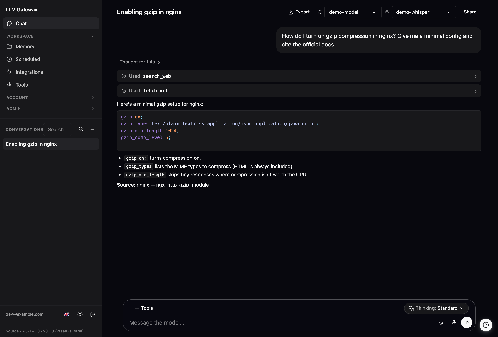

## Contents

- [What it does](#what-it-does)
- [Tools the model can call](#tools-the-model-can-call)
- [The built-in web UI](#the-built-in-web-ui)
- [Scheduled actions](#scheduled-actions)
- [Conversation compaction](#conversation-compaction)
- [Voice conversation](#voice-conversation)
- [Integrations (per-user MCP connectors)](#integrations-per-user-mcp-connectors)
- [Quick start (local development)](#quick-start-local-development)
- [Configuration](#configuration)
  - [Chat attachments (S3)](#chat-attachments-s3)
  - [RAG (codebase search)](#rag-codebase-search)
  - [Agent Skills](#agent-skills)
- [Using the gateway](#using-the-gateway)
  - [HTTP endpoints](#http-endpoints)
- [Production deployment (container + systemd)](#production-deployment-container--systemd)
  - [Docker Compose](#docker-compose)
- [Documentation](#documentation)
- [Contributing](#contributing)
- [License](#license)

## What it does

- **OpenAI-compatible API** — `POST /v1/chat/completions` (streaming + non-streaming), `POST /v1/embeddings`, `POST /v1/images/generations` + `POST /v1/images/edits`, `POST /v1/audio/transcriptions`, `POST /v1/audio/speech` (text-to-speech, when a speech pool is configured), and `GET /v1/models`. Point any OpenAI SDK at it.
- **Multi-backend routing** — named upstream pools (`chat` / `transcription` / `embedding` / `image` / `speech` kinds). Each pool load-balances across its backends (round-robin or least-in-flight) with per-backend health probes. Models are discovered live from each backend's `/models` endpoint, so loading a model on a backend makes it routable with no config change.
- **Model aliases + fallback** — give clients a stable name (a per-backend alias like `qwen`) that routes to whatever real model is loaded, so swapping the model needs no client change; the same alias on several backends is a load-balanced group. Optional fallbacks cover an unknown model name or a known model whose backends are all down. All configured per backend/pool at `/admin/upstreams`. See [`docs/upstreams.md`](docs/upstreams.md#model-aliases).
- **OIDC login** — browser sign-in against your identity provider; the gateway then issues its own `gwk_…` API tokens. Provider secrets come only from the environment.
- **Per-user tokens + RBAC** — tokens are SHA-256-hashed at rest and revocable. Roles (mapped from OIDC claims) gate which models and server-side tools each user may use.
- **Usage accounting, rate limits & quotas** — every call is metered per user/token/model (requests, tokens, and — with per-model prices — spend), shown on `/usage`. Set hard rate limits and quotas at `/admin/limits` (requests / tokens / cost, over a rolling hour / day / week / month), scoped globally, per-role, or per-user; over-budget callers get a `429`. Self-hosted pools can be marked exempt (a per-pool toggle at `/admin/upstreams`) so their usage is still recorded and shown on `/usage`, but never counts against a limit or quota.
- **Server-side tools** — the gateway runs tools *mid-completion* (web search, fetch-URL, document rendering, code execution, RAG, network lookups, and more); the client just sees a normal completion. Full list in [Tools the model can call](#tools-the-model-can-call).
- **Chat UI** — a server-rendered, mobile-friendly chat at `/chat` with persisted multi-conversation history, token-by-token streaming, file attachments, voice dictation, shareable/exportable conversations, and resume-on-reconnect (every turn is written to SQLite as it happens).
- **RAG** — operator-managed, indexed codebases that the chat model can search.
- **Agent Skills** — drop a `SKILL.md` bundle (or `.skill` archive) in and the chat model loads it on demand to follow your house style, brand, or domain playbooks — progressive disclosure, no fine-tuning. Admins upload/view/delete global skills at `/admin/skills` (live, no restart, RBAC-gated per role); every user can also add their **own private skills** at `/skills`, usable only in their own chats. See [Agent Skills](#agent-skills).
- **Scheduled actions** — per-user prompts that run on a cron schedule (hourly / daily / weekly / monthly, or a raw cron expression), each evaluated in its own timezone. A friendly builder assembles the cron and shows the next run times live; every fire opens a chat you can read back in the UI — a fresh one each time, or (optionally) continuing the previous run's conversation as history. See [Scheduled actions](#scheduled-actions).
- **Integrations (per-user MCP connectors)** — an admin-curated catalog of [MCP](https://modelcontextprotocol.io/) servers (Google Workspace, GitHub, Atlassian, GitLab, …) that each user connects to with *their own* account at `/integrations`. OAuth (with dynamic client registration where supported) or a user-supplied token; tokens are encrypted at rest and refreshed in the background. The connected servers' tools then become available to the model, scoped to that user's own permissions. See [Integrations](#integrations-per-user-mcp-connectors).

## Tools the model can call

This is the part most "OpenAI-compatible proxy" projects don't have. The gateway can execute tools **server-side, in the middle of a completion**: the model asks to search the web, read a PDF you attached, render a branded PDF, run code in a throwaway sandbox, or query an indexed codebase — the gateway runs it, feeds the result back, and the client just receives one ordinary completion with the finished answer. It works identically through the raw `/v1/chat/completions` API and the built-in chat UI.

Every tool is **RBAC-gated per role**, and each user can flip their own grants on and off on the `/tools` page:

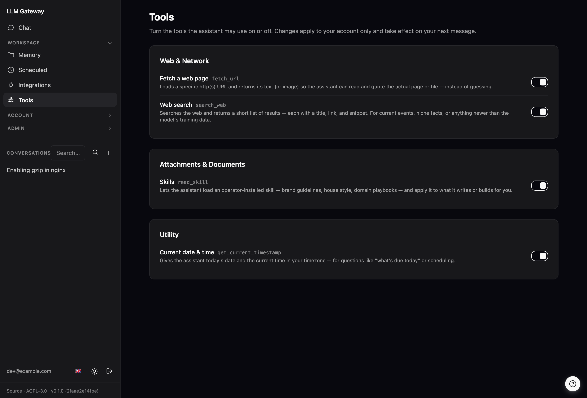

| Category | Tools | What the model can do |
|---|---|---|
| **Web & retrieval** | `search_web`, `fetch_url`, `wikipedia` | Search the web (SearXNG or Brave — configured under **Web search** on `/admin/models`, with optional per-query domain and recency filters), fetch any URL (**HTML is reduced to readable text** — headings, lists, links, tables and code survive, scripts and markup don't, so a page costs a few KB instead of a few hundred; `raw: true` when the markup itself is the point — images → viewable, other binary → metadata), and pull encyclopedic summaries. |
| **Documents** | `fetch_attachment`, `upload_attachment`, `offer_download`, `import_file`, `list_attachments`, `typst_*` | Read files the user attached — including **two-tier PDF** reading (extract the text layer first; rasterize scanned pages for a vision model if that comes back empty) with **page ranges** so a long document is read one window at a time instead of only its first pages — attach files back into its own reply, **hand over any file the conversation already holds** as a download (copied inside storage, so a big payload never gets pasted into the reply as text), **pull a text file into the editable canvas** so it can be changed a passage at a time instead of rewritten, list every file in the conversation (uploads + earlier tool outputs) so assets get **reused instead of regenerated** (attachments resolve by id *or* bare filename, newest wins), and render **PDF/PNG documents** from operator-defined Typst templates (invoices, letters, reports) whose **field data lives in the canvas** — visible, versioned, downloadable, and editable by hand. |
| **Automatic document OCR** *(opt-in)* | `baidu/Unlimited-OCR` via the internal `ocr` pool | Send uploaded images, and PDFs without a usable text layer, to the PDF-aware OCR sidecar and add the result as untrusted document context — cached by document hash, page-ordered, metered, with per-document status in the chat UI. The feature is inactive unless `[chat.ocr].enabled = true` and a healthy `ocr` backend are both configured. See [`docs/ocr.md`](docs/ocr.md). |
| **Document canvas** | `create_document`, `edit_document`, `delete_document`, … | Build up a long document (report, spec, article) across turns and edit it section-by-section in a live side panel, then export it to PDF/DOCX/PPTX — instead of regenerating the whole thing every reply. Every change is a new version; the model can list the history and roll back (`list_document_versions`, `restore_document_version`), and several documents can coexist per conversation. **You can edit any document by hand** in the panel — your save is a version of its own, labelled as yours, and the assistant is told the document moved under it (with the id to re-read) so its next edit builds on your wording instead of reverting it. Abandoned drafts can be **cleared away without losing anything**: `delete_document` is a soft delete — the document leaves the canvas and the model's listing but keeps its history, and `undelete_document` brings it back. Formats: markdown, text, html, json, toml, **typst** (draft the source in the canvas, render via `render_typst`/`export_document` — sections anchor on `=` headings), and yaml (text-edited so comments survive). See [`docs/file-conversions.md`](docs/file-conversions.md). |
| **Images** | `generate_image`, `edit_image` | Generate an image from a text prompt (diagrams, mockups, marketing visuals) and, where the backend supports it, edit an existing image (image-to-image) — rendered inline in the reply. Routes to an `image`-kind upstream pool (any OpenAI `/images/*`-compatible backend: a hosted provider or a self-hosted model). `edit_image` appears only when a backend advertises edit support, and is refused against non-GDPR-compliant backends. |
| **QR codes** | `generate_qr_code` | Generate a QR code natively in the gateway (no sandbox, no backend) — URLs, WiFi access, vCard/MeCard contacts, `mailto:`/`tel:`/`geo:`, SEPA GiroCode payments — as PNG or SVG, with custom colors and an optional centered logo from a chat attachment (error correction auto-raised to H). Attached inline in the reply. |
| **Code & sandbox** *(opt-in)* | `run_in_sandbox`, `generate_document`, `export_document`, `convert_document`, `edit_presentation`, `capture_webpage`, `browse_page`, `render_typst`, `render_excalidraw`, `read_sandbox_output` | Run Python/shell in an isolated gVisor VM (data crunching, format conversion, plotting; `run_in_sandbox` persists its workdir across a conversation turn so the model can iterate), turn Markdown into PDF/DOCX/PPTX, convert between office/PDF/image formats, edit an uploaded `.pptx` in place, screenshot a web page, **drive a browser across several steps** (`browse_page` — click, fill a form, get past a consent banner, then read the result: the session stays open for the whole turn), render Typst or Excalidraw, and page through a large sandbox result without pulling it all into context. The web tools appear **only when the sandbox runner is configured for network egress** — the gateway asks it at startup, so on an offline runner the model is never offered a browser it cannot use, and `run_in_sandbox` doesn't even show a `network` option. Enabled by the `[sandbox]` block — see [`docs/sandbox.md`](docs/sandbox.md) and [`docs/file-conversions.md`](docs/file-conversions.md). |
| **Memory** | `remember`, `recall`, `update_memory`, `forget` | Persist durable facts about the user (preferences, projects) and recall them in later conversations — and **correct or drop** one when it changes, so a changed fact replaces the old one instead of leaving two contradicting memories behind. |
| **Scheduled actions** | `schedule_action`, `list_scheduled_actions`, `delete_scheduled_action` | Set up recurring prompts from inside a conversation — "every Monday, summarise last week's tickets" — reaching the same cron scheduler the [`/scheduled`](#scheduled-actions) page drives. Each run opens a conversation you can read afterwards, on the model you were talking to. Creating or deleting one **needs your confirmation** (via `ask_user`) and an action created this way always runs **without tools**: a scheduled prompt later runs *as you*, unattended, so it is not something a model should be able to plant on its own. |
| **Notifications** | `notify_user` | Reach you when you're not watching the conversation — long sandbox work finished, or a scheduled action found something worth knowing — as a Web Push notification on your phone or desktop. Hard-limited to one per reply, and only where you enabled notifications. |
| **Asking you** | `ask_user` | When a choice would change what it builds and guessing would waste the work, the assistant asks — inline, mid-answer, with optional buttons plus a free-text field — and waits for your reply instead of ending the turn with a question. Times out and proceeds on a stated assumption if nobody answers. |
| **Network & ops** | `dns_lookup`, `whois_lookup`, `tls_cert`, `lookup_ip` | DNS-over-HTTPS records, RDAP domain registration, TLS-certificate inspection ("is this cert about to expire?"), and GeoIP for any IP or hostname. |
| **Location** | `get_user_location` | Use the approximate IP-based location that's always in context, or ask the browser for precise GPS when the task needs it. |
| **Utility** | `convert_currency`, `get_current_timestamp`, `company_echo` | Convert currencies at daily ECB rates, get the timezone-aware current time, and echo a message back verbatim (`company_echo` is a built-in smoke test for the tool-call loop). |
| **Knowledge base** | `rag_list_collections`, `rag_search`, `rag_grep` | Search operator-indexed codebases/corpora and get back the matching chunks with file paths, line ranges, and scores. Search is **hybrid** — dense vectors fused with FTS5/BM25 — so exact identifiers land as well as paraphrase, and a `path_glob` scopes a query to part of the corpus. `rag_grep` covers what ranking can't express: a **regular expression** over the indexed text, returning matching lines with line numbers and context (bounded by result/row/time limits, since it has no index behind it). |
| **Integrations** | `mcp__<server>__*` | Call the tools of any bridged [MCP](https://modelcontextprotocol.io/) server. Each server's tools are namespaced so two servers can't collide. |
| **Skills** | `read_skill` | Load an operator-installed [skill](#agent-skills) — brand guidelines, house style, domain playbooks — then apply it: pull the `SKILL.md`, then any referenced asset (e.g. an SVG to inline). |

**Tools turn themselves on.** Tools start *off* to keep the model's tool list short — short lists are cheaper and the model picks tools more accurately. When a request needs a capability the model doesn't currently have, it calls a built-in `enable_tools` tool to switch the relevant ones on; their real schemas appear on the next turn and stay on for the rest of the conversation. So the model reaches for exactly what it needs, when it needs it, without the operator wiring per-conversation tool lists — all still bounded by what the user's role permits.


## The built-in web UI

Beyond `/chat`, the gateway ships a small operator and account UI — no separate dashboard to deploy. Admin pages are gated to the `admin` role.

The UI is fully localized — English, German, French, Spanish, Russian, and Chinese. Switch languages from the flag icon in the sidebar (or on the login page); the choice is stored in a cookie, so it applies immediately and persists across sessions.

| | |
|---|---|
|  | 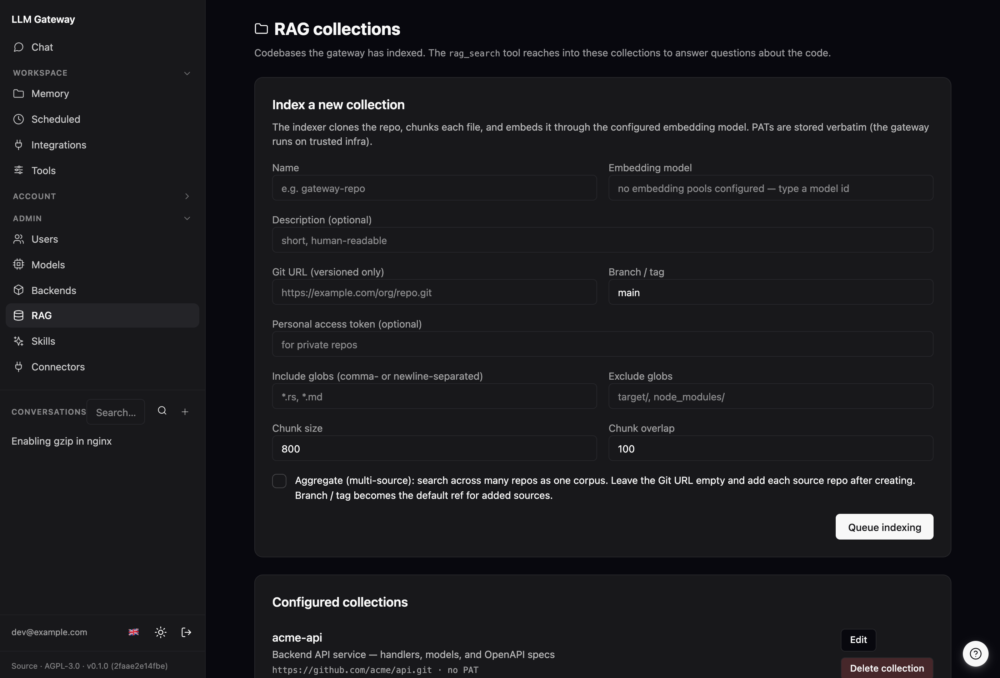 |
| **Upstreams** (`/admin/upstreams`) — one page for pools and backends: live health, in-flight load, and discovered models per pool, with inline add/edit/delete of pools and backends (API key stored encrypted, so a new backend goes live on "Apply changes" without a restart). A sticky bar counts unapplied topology edits until you reload the runtime registry. | **RAG** (`/rag`) — index a codebase from a git URL and watch it go from *pending* to *ready*. |

There's also `/tokens` (mint, rotate, and revoke your `gwk_…` API tokens — and scope each token to a subset of your tools), `/usage` (your own request/token usage, plus spend when per-model prices are set), `/memory` (view and edit what the assistant has remembered about you), `/scheduled` (prompts that run on a cron schedule — see [Scheduled actions](#scheduled-actions)), `/admin/models` (server-wide sampling defaults, per-model reasoning budgets, per-model context windows that drive [conversation compaction](#conversation-compaction), per-model **prices** (input/output per 1M tokens) that turn token usage into spend on `/usage`, the per-feature **default model** pre-selected for chat, voice, image generation, and the RAG embedding picker, and the **web-search backend** the `search_web` tool uses — SearXNG URL or Brave API key, the key encrypted at rest), `/admin/limits` (rate limits & quotas — see below), and `/admin/users` (registered users with their resolved roles). The users page can also let an admin **impersonate** another user for debugging — every impersonation is audited and shows a persistent banner. Impersonation is **opt-in**: it's off unless you set `[gateway].allow_impersonation = true` (default `false`), in which case the Impersonate buttons appear and `POST /admin/users/impersonate` is accepted; otherwise the buttons are hidden and that endpoint returns 403.


| | |
|---|---|
| 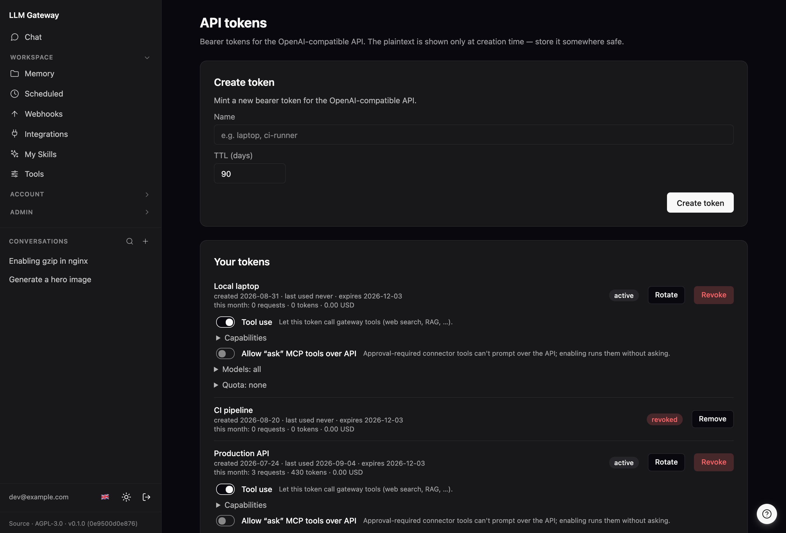 | 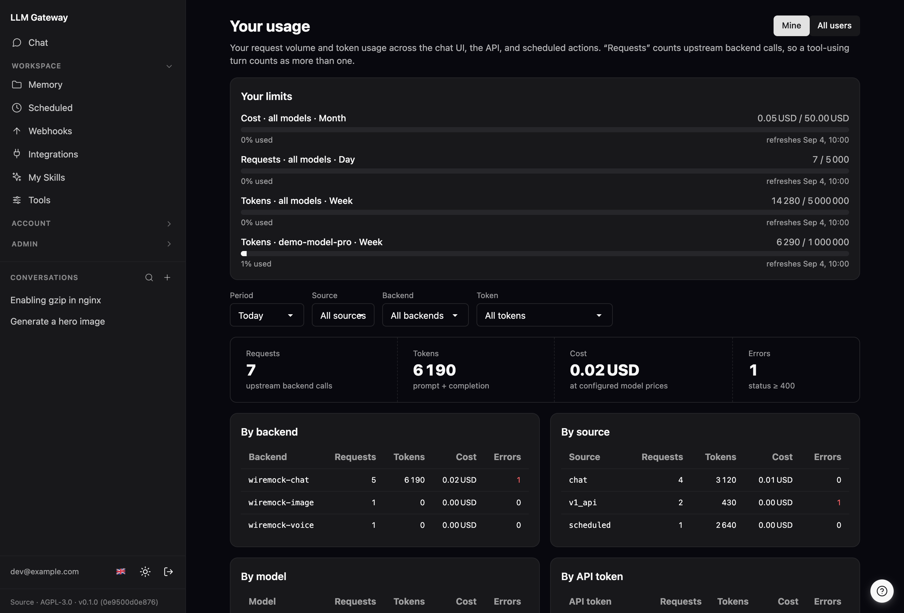 |
| **API tokens** (`/tokens`) — mint, rotate, revoke, and per-token tool scoping. | **Usage** (`/usage`) — your own request/token volume, broken down by backend, source, and model. |

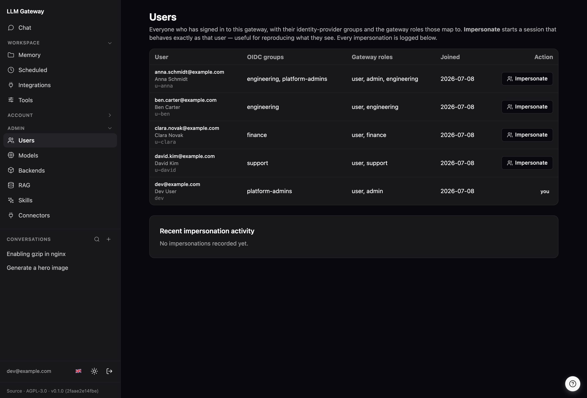

**Rate limits & quotas.** At `/admin/limits`, cap how many **requests**, how many **tokens**, or how much **spend** a caller may use over a rolling **hour / day / week / month** — scoped **globally**, **per role**, or **per user**. Rules resolve most-specific-first (user → most-generous role → global default); with none configured everyone is unlimited. A user's whole budget is shared across their API tokens, chat, and scheduled runs, and an over-budget caller gets a `429` (or a graceful notice in chat). Self-hosted pools can be marked exempt at `/admin/upstreams` so their usage is still recorded on `/usage` but never counts against a limit. Everyone sees their own live limit bars on `/usage`.

| | |
|---|---|
|  |  |
| **Rate-limit editor** (`/admin/limits`) — global / role / user rules across requests, tokens, and cost. | **Your limits** (`/usage`) — live bars of used-vs-limit with reset times, plus spend once models are priced. |

The `/chat` page itself does more than stream replies: **fork** a conversation, **share** it via a public link, **pin** favourites, **export** to Markdown or PDF, **edit-and-retry** a turn, **dictate** with the voice button, and set **per-conversation reasoning effort**. See [`docs/ui.md`](docs/ui.md).

**Mobile.** The whole UI is responsive — on a phone the sidebar collapses into a hamburger drawer and the chat, composer, and admin pages reflow to a single column, so the gateway is fully usable from a browser on the go.

| | |
|---|---|
| 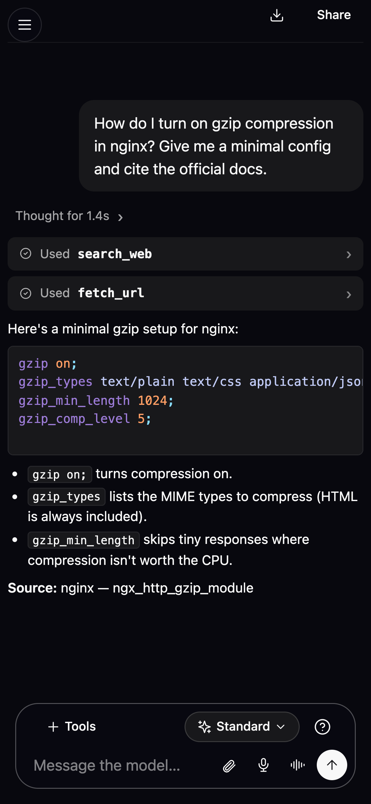 | 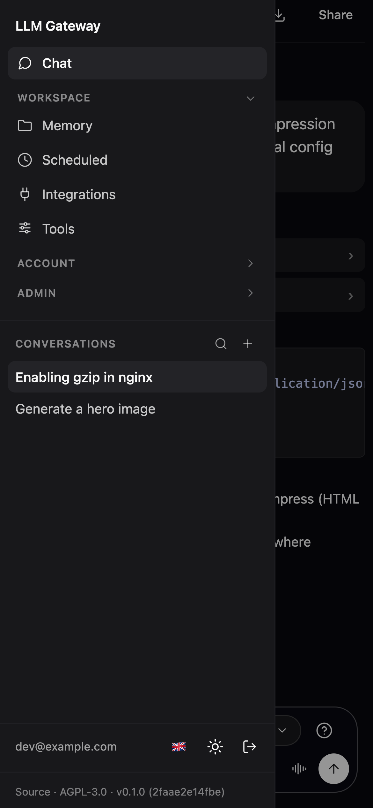 |

## Scheduled actions

Every signed-in user can have prompts run **automatically on a schedule** at `/scheduled` — a daily standup digest, a weekly repo summary, an hourly health check. Each scheduled action is just a saved prompt plus a model, a schedule, and a timezone; when it fires, the gateway opens a chat session driven by the same engine as the interactive `/chat` page, so the result lands as an ordinary conversation you can open and read afterward. By default each run starts a **fresh** conversation; turn on **reuse** and each run instead continues the previous run's chat — replaying the last few rounds as history — so the model builds on what it said last time. Schedules are per-user and private (scoped by user, behind the normal session login — no admin role needed).


**The schedule builder.** Pick **Hourly**, **Daily**, **Weekly**, **Monthly**, or **Advanced**. The friendly modes expose just the fields they need (a minute; a time; weekday checkboxes; a day-of-month) and the gateway assembles a standard 5-field cron expression from them — non-technical users never have to see cron. **Advanced** takes a raw `minute hour day-of-month month day-of-week` expression for anything the presets can't express. Either way the expression is evaluated in the **IANA timezone** you choose (e.g. `Europe/Berlin`), and a live preview — computed server-side via `POST /scheduled/preview` so it can't drift from what the scheduler actually does — shows a plain-English summary plus the **next three run times**. Each action also has a tools toggle (web search, RAG, attachments — same set as in chat).

**How runs fire.** A background worker polls every 30 seconds and runs every action whose next occurrence is due, claiming each one atomically first so a slow run or a restart can't double-fire. If the gateway was down across one or more scheduled slots, the missed occurrences **collapse into a single catch-up run** on the first poll after startup rather than replaying as a backlog. Actions can be **paused** (the worker skips them) and resumed, edited, or deleted from the same page.

## Webhooks

The event-driven twin of scheduled actions: instead of a clock, an **inbound HTTP call** fires the run. At `/webhooks` a signed-in user saves a prompt plus a model, gets back a secret trigger URL (`/hooks/gwh_…`), and points any external service at it — a CI pipeline, a GitHub or Discord webhook, a monitoring alert, a form handler, or a quick `curl`. When something calls the URL, the gateway appends **whatever the caller sends in the request body** (JSON or plain text) to the saved prompt as a clearly delimited *untrusted* block, then runs it through the same engine as `/chat`, so the result lands as an ordinary conversation you can open afterward.

**Sync or async.** A per-webhook checkbox picks the behaviour: an **async** webhook returns `202 Accepted` immediately and runs in the background; a **synchronous** webhook makes the caller wait and returns the model's answer as a JSON envelope (`{"status","session_id","output"}`) — handy for integrations that want the reply inline.

**Fresh chat or reuse.** Like scheduled actions, a webhook either opens a **fresh chat per fire** (the default) or **reuses** the previous fire's chat so the model sees prior fires as history (a running incident log, a rolling digest) — with a replay-rounds cap so the context can't grow without bound.

**Run history.** Every fire — and every rerun — is logged. Each webhook has a **Runs** page listing its most recent runs (up to 50), each showing when it fired, whether it succeeded, and a link to **its generated chat** for the full details. From there you can **rerun any past run**: its exact payload is replayed with a prompt you can tweak, into a fresh chat you watch live. So you can iterate on the prompt without asking the external service to re-send anything.

**Security.** The secret in the URL is the credential — only its hash is stored, so the full URL is shown **once** on create (rotate to mint a new one; the old URL stops working immediately). Tools default **off**: because a webhook is triggered by an anonymous external caller feeding attacker-controllable text to a model that would run *as you*, granting it your tools (web search, RAG, connectors) is a deliberate, warned opt-in. Webhooks are per-user and private, and can be paused, edited, rotated, or deleted from the same page. (Rate limiting and quotas are handled separately, across all request surfaces.)

## Conversation compaction

A chat replays its whole history to the model on every turn, so a long conversation's prompt grows until it crowds the model's context window. The gateway **compacts automatically**: once a turn's measured prompt size (the upstream's own `prompt_tokens`) crosses a fraction of the model's context window, a background task — off the turn's critical path, like title generation — summarises the oldest turns into a single dense summary. The next turn then replays `[request context] + [summary] + [most recent turns verbatim]` instead of the full history. As the conversation keeps growing it's **re-compacted**: the previous summary plus the newly-aged turns fold into a fresh summary, so context stays bounded across an arbitrarily long chat.

Nothing is lost from the UI — the summarised turns stay in the transcript, scrollable above an "earlier messages condensed" divider; they're just not sent upstream. Tool results from the folded turns are fed into the summariser (they're never replayed as normal history, yet are often the load-bearing context).

Tuning lives in `[chat.compaction]` (all optional): `enabled` (default `true`), `trigger_ratio` (fraction of the window at which it fires, default `0.7`), `default_context_window` (fallback window in tokens for models without a per-model value, default `32768`), `keep_recent_turns` (how many recent turns stay verbatim, default `6`), `min_turns_to_compact` (anti-thrash floor, default `4`), and `summary_max_tokens` (default `1024`). Per-model context windows are set in `/admin/models`; a blank field falls back to `default_context_window`.

## Voice conversation

Talk to the assistant and hear it answer. Voice mode is a **pipeline** — the gateway is not the AI, it wires access to one: your speech is transcribed (Voxtral, the existing transcription pool), sent to the normal chat model with a *voice directive* that keeps replies to a spoken sentence or two, and the reply is spoken back through a **text-to-speech pool** you configure. Every exchange persists as an ordinary chat turn in plain text, so you can scroll back and read (or continue in text) any time.

It appears in the chat composer **only when a `speech` upstream pool is configured** *and* a transcription model is available — otherwise the toggle is simply absent (like transcription, it degrades away). Same access layer as everything else: TTS is also exposed to API callers at `POST /v1/audio/speech`.

**Configure it** by adding a `speech`-kind pool at `/admin/upstreams` — self-hosted (Qwen3-TTS, Kokoro, XTTS via openedai-speech, LocalAI) or cloud (**OpenAI** `api.openai.com/v1`, or any provider that speaks OpenAI's `/v1/audio/speech`). An optional per-language voice map picks a voice per spoken language (`de`, `en`, …; the default applies when none matches). Flag the pool's compliance on a non-EU provider (e.g. OpenAI) — voice mode sends the spoken text there. See [`docs/upstreams.md`](docs/upstreams.md).

**Which voice you hear** is the user's own choice, not just the operator's. Fill the pool's **selectable voices** list (one id per line) and a voice picker appears in the chat header next to the mic-model one; the pick is stored per user and beats the language map on every synthesis. It stays hidden while there is nothing to choose, and a voice the operator later removes from the list silently falls back to the language default instead of reaching the provider as an unknown id. The language map keeps answering the *other* question — which voice a given spoken language defaults to — and holds one voice per language, which is why the menu is its own list.

**How it works:** push-to-talk (hold the mic) → release → the transcript is submitted with the voice directive → as the reply streams, complete sentences are spoken one at a time. Non-speakable bits (code, tables) become a short spoken marker like "the code is shown on screen." It's **half-duplex** — while the assistant speaks, the mic is inert (no echo loop). The reply's language follows what you *spoke*; only the opening greeting uses the UI language. Always-listening (voice-activity) mode and barge-in are a planned next phase.

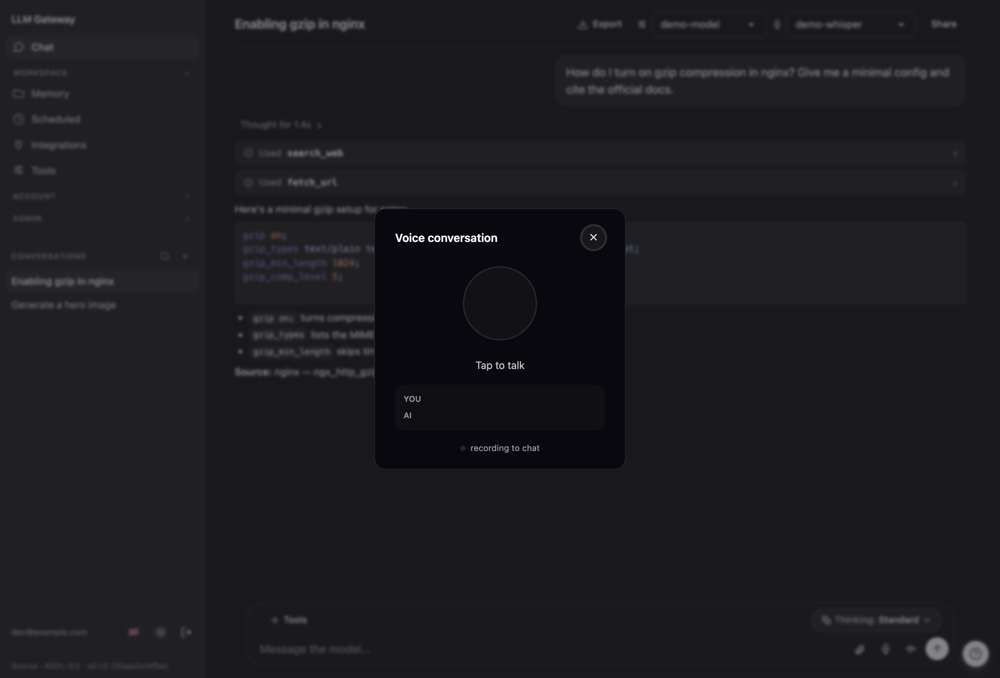

- **Rust** (edition 2024, toolchain pinned to 1.95 via [mise](https://mise.jdx.dev/)) — a workspace of 5 crates: `gateway`, `session-core`, `cli`, `shared`, and `sandbox-runner`.
- **[rama 0.3.0-rc1](https://ramaproxy.org/)** — HTTP server, router, middleware, and proxying.
- **[plait](https://github.com/devashishdxt/plait)** — type-checked, auto-escaping server-rendered HTML (`html! { … }`).
- **[datastar](https://data-star.dev/)** — client-side reactivity over SSE, self-hosted from the binary.
- **[daisyUI v5](https://daisyui.com/) + Tailwind v4** — design system, compiled to a single CSS file at build time.
- **sqlx + SQLite** — persistent state (users, tokens, sessions, chat history, RAG collection registry). Bulk RAG content — chunk text, lexical index, vectors — lives in per-collection stores under `[rag].data_dir`, not in the main DB.

The CSS bundle and `datastar.js` are baked into the binary via `include_bytes!`, so the runtime image needs no asset directory.

## Integrations (per-user MCP connectors)

Each signed-in user can connect their **own** accounts — Gmail/Calendar/Drive, GitHub, Atlassian (Jira/Confluence), GitLab, Slack, Kiwi.com flight search, and any other [MCP](https://modelcontextprotocol.io/) server — at `/integrations`, so the model can act on their behalf with **their** permissions. It's a self-hosted, per-user connector store comparable to the connectors in desktop AI apps.

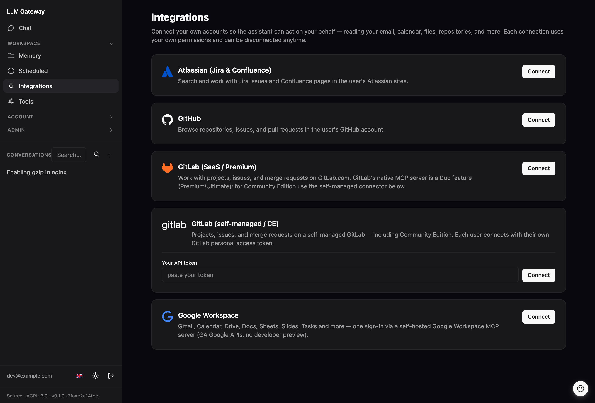

An admin curates which servers the catalog offers at `/admin/connectors`; users just click **Connect**. Four auth models are supported, chosen per connector:

- **OAuth 2.1 + dynamic client registration** — nothing to configure beyond a URL (e.g. Atlassian, GitLab.com, a self-hosted Google Workspace server).
- **OAuth 2.1 with a manual client** — the admin registers one OAuth app once (e.g. GitHub, Slack).
- **User-supplied token** — each user pastes their own API token / PAT (e.g. self-managed GitLab CE).
- **None** — a public, unauthenticated server (e.g. Kiwi.com flight search); users still connect individually to opt its tools into their own chats.

Per-user OAuth tokens are **encrypted at rest** (AES-256-GCM) and **refreshed in the background** so connections don't silently expire. Each connected server's tools are namespaced (`mcp__<server>__*`) and obey the same per-tool always/ask/off controls as the built-in tools. Provider and deployment setup — including the self-hosted Google Workspace and GitLab CE bridges — is in [`deploy/README.md`](deploy/README.md) and [`docs/connectors.md`](docs/connectors.md).

## Quick start (local development)

You need [mise](https://mise.jdx.dev/), which manages the Rust + Node toolchains.

```bash
mise install                      # Rust 1.95 + Node 24
cp gateway.example.toml gateway.toml
$EDITOR gateway.toml              # set [oidc] to sign in + an admin role in [rbac]; add backends in the UI after
mise run dev                      # runs the gateway (debug build) on http://localhost:8080
```

If you're editing the UI, run the asset watchers in separate terminals (the committed bundles mean these are optional for plain backend work):

```bash
mise run watch-css                # rebuild app.css on change
mise run watch-js                 # rebuild app.js on change
```

Open <http://localhost:8080>. Signing in / minting tokens needs an `[oidc]` block (see below).

**UI-only shortcut (no OIDC):** `mise run dev-ui` boots a real server with mock backends and a pre-seeded session, and prints a session cookie you can paste into a browser or Playwright.

Full developer workflow: [`docs/dev-workflow.md`](docs/dev-workflow.md).

## Configuration

Configuration is a single TOML file — `gateway.toml` in the working directory, or wherever `$GATEWAY_CONFIG` points. [`gateway.example.toml`](gateway.example.toml) is the fully-commented reference; copy it and trim to taste.

**Secrets never live in the file.** The config holds the *names* of environment variables (e.g. `session_key_env = "GATEWAY_SESSION_KEY"`); the gateway reads the actual values from its own environment at startup.

A minimal but complete config:

```toml
[bind]
host = "127.0.0.1"     # bind loopback; put a TLS-terminating reverse proxy in front
port = 8080

[db]
path = "gateway.sqlite"

[gateway]
public_url          = "https://gateway.example.com" # external URL; used to build the OIDC callback
token_ttl_days      = 90
session_key_env     = "GATEWAY_SESSION_KEY"          # names the env var holding a 64-hex (32-byte) key
allow_impersonation = false                          # opt-in admin impersonation (default false); see below

# Needed for sign-in + token minting. Without it, /auth/login and the /login
# page don't work — and since you configure everything else through the signed-in
# admin UI, this is what bootstraps a new install.
[oidc]
issuer            = "https://id.example.com/realms/company"
client_id         = "llm-gateway"
client_secret_env = "GATEWAY_OIDC_CLIENT_SECRET"
scopes            = ["email", "profile", "groups"]
roles_claim       = "groups"

# Make your own account an admin so you can reach /admin/*. An admin role is a
# role flagged `admin = true`; you hold it by mapping one of your OIDC groups to
# it. Without this, nobody can open the admin UI — where all upstream and model
# config now lives — so a new install needs it to get off the ground.
[rbac]
default_role = "user"                    # every signed-in user gets this baseline role

[[rbac.mapping]]
oidc_claim = "groups"
oidc_value = "platform-admins"           # an OIDC group you belong to
role       = "admin"

[[roles]]
id = "user"                              # baseline: can chat, mint tokens, use tools
models = ["*"]

[[roles]]
id = "admin"                             # `admin = true` is what unlocks /admin/*
admin = true
models = ["*"]
tools = ["*"]
skills = ["*"]
```

**How you configure upstreams and models: through the admin UI, not this file.** Pools, backends, and per-model settings live in the database and are managed entirely at `/admin/*` — there is no TOML for them. A fresh install boots with no upstreams; the setup path for a new operator is:

1. Write `gateway.toml` with the blocks above — `[oidc]` so you can sign in, and `[rbac]` + `[[roles]]` so your account resolves to an `admin = true` role.
2. Start the gateway and sign in. Your account now reaches the admin UI.
3. At [`/admin/upstreams`](#the-built-in-web-ui), add a pool (chat / transcription / embedding / image / speech) and its backends — base URL, API key (stored encrypted), weight, max in-flight, aliases, per-pool compliance and rate-limit flags, and unknown-model / all-offline fallbacks. Click **Apply changes** and it goes live — no restart.
4. At `/admin/models`, set per-model prices, reasoning budgets, context windows, capabilities, sampling defaults, the per-feature default model, and the web-search backend (SearXNG URL or Brave API key) that powers `search_web`.

Routing then needs no static table: the health probe reads each backend's `/models` endpoint and routes by what it advertises. See [`docs/upstreams.md`](docs/upstreams.md) for the routing model.

The environment variables that config refers to:

```bash
export GATEWAY_SESSION_KEY=$(openssl rand -hex 32)   # 32 random bytes, hex-encoded
export GATEWAY_OIDC_CLIENT_SECRET=…                  # from your OIDC provider
export GATEWAY_ENCRYPTION_KEY=$(openssl rand -hex 32) # optional: 32-byte key encrypting the DB's at-rest secrets
```

`GATEWAY_ENCRYPTION_KEY` is optional: it's the AES-256-GCM key under which the gateway's database-stored secrets are encrypted — each user's MCP-connector OAuth tokens, admin-stored connector client secrets, and **upstream backend API keys entered through the admin UI**. If unset, the gateway derives a stable key from `GATEWAY_SESSION_KEY`; if *that's* also unset (dev), an ephemeral key is used and stored secrets won't survive a restart (users reconnect; re-enter backend keys). Set it explicitly if you want at-rest encryption decoupled from session-cookie signing. **Rotating this key invalidates already-stored ciphertext** — re-enter backend keys (or keep them in env vars via `api_key_env`) after a change. *(Formerly `GATEWAY_MCP_KEY`. If you set it explicitly, rename the env var to the same value and nothing else changes. If you relied on the key derived from `GATEWAY_SESSION_KEY` (env unset), the derivation changed in this release — reconnect MCP connectors and re-enter backend keys once after upgrading.)*

Optional blocks, each documented inline in `gateway.example.toml`:

- `[rbac]` + `[[roles]]` — map OIDC claim values to roles, and gate models/tools per role.
- `[chat.s3]` — store chat attachments in S3 / MinIO / R2 / Backblaze B2 (see below).
- `[chat.ocr]` — opt into automatic PDF/image OCR through a configured internal `ocr` pool (see [`docs/ocr.md`](docs/ocr.md)).
- `[typst]` — register document-rendering tools from a templates directory.
- `[sandbox]` — enable the code-execution + document tools by pointing at a sandbox-runner service (see [`docs/sandbox.md`](docs/sandbox.md)).
- `[geoip]` — IP→location for the `get_user_location` tool (IP2Location LITE database).
- `[rag]` — index git repos and search them from chat (see [RAG](#rag-codebase-search)).
- `[usage]` — request/token usage accounting behind the `/usage` page (retention-pruned; on by default).
- `[feedback]` — the in-UI feedback widget that files GitHub issues.

### Chat attachments (S3)

The chat composer accepts any file via paperclip / drag-drop / clipboard paste. Each file is uploaded to S3 (or any S3-compatible store) and either inlined into the user message as a fenced text block (CSV / JSON / source code / …) or referenced via `image_url` content parts on the OpenAI request (images). Add a `[chat.s3]` block:

```toml
[chat.s3]
endpoint        = "https://s3.eu-central-1.amazonaws.com"
region          = "eu-central-1"
bucket          = "my-gateway-attachments"
access_key_env  = "GATEWAY_S3_ACCESS_KEY"
secret_key_env  = "GATEWAY_S3_SECRET_KEY"
# key_prefix    = "chat-attachments"   # optional, this is the default
```

…and export the credentials in the gateway's environment:

```bash
export GATEWAY_S3_ACCESS_KEY=AKIA…
export GATEWAY_S3_SECRET_KEY=…
```

Notes:
- The bucket can stay **fully private** (no public-read ACL, no presign capability needed on the credentials): the gateway fetches every byte **server-side** and hands it to the upstream LLM inline — images as a `data:` URI in the request, other files as text. So `endpoint` only needs to be reachable from the **gateway**, not from the upstream LLM's network. Path-style requests are always used, so DNS-style bucket subdomains aren't required; the same shape works for MinIO, Backblaze B2, and R2.
- Capability gating isn't done at the gateway — wire only multi-modal chat models into the pools. A mismatch surfaces as the upstream's own error in the chat bubble.
- Past-turn attachments are stripped from the replayed history (kept as `[attached: name.ext (omitted)]` stubs) so the context window stays bounded.

When automatic OCR is enabled, the current turn's image attachments — and any
PDF whose text layer is too thin to trust — are sent to the internal OCR sidecar
before the chat request. The sidecar owns PDF conversion and calls
Unlimited-OCR; recognised text arrives in the user message as clearly delimited
untrusted document data, and the original upload stays available through
`fetch_attachment` (which also gains `mode="ocr"` and `mode="auto"`). Results are
cached by document hash, so the same document is recognised once and reused on
later turns and across restarts, and each run shows up as a `document_ocr` row
in the turn's activity list with queued/running/completed/failed status. If no
healthy `ocr` backend is configured, the gateway does not fetch the attachment
for OCR and does not expose an OCR capability to the model. See
[`docs/ocr.md`](docs/ocr.md).

### RAG (codebase search)

Point the gateway at git repositories; it clones, chunks, and embeds them, and exposes them to the chat model through the `rag_search` tool (plus `rag_list_collections`, so the model can discover what's available). It's for "answer from *our* code and docs" without stuffing a whole repo into the context window.

**Requirements:** an `embedding`-kind upstream pool (chunks and queries are embedded through it), `git` on the host PATH (the indexer shells out to it — the container image ships it), and a `[rag]` block. The block is optional; its main knob is `data_dir` (a second, `clone_concurrency`, is documented in `gateway.example.toml`):

```toml
[rag]
data_dir = "/mnt/data/gateway-rag"   # optional; default ./data/rag
```

Each collection gets a self-contained folder `<data_dir>/<uuid>/` holding its SQLite store (chunk text + lexical index), its `index.usearch` (vectors), and the git `clone/`. This is the heavy, fully regenerable state — put `data_dir` on a big/cheap disk, separate from the small `[db].path` you actually back up. Deleting a collection in the UI removes its folder.

**Adding a collection.** As an admin, open `/rag` (or `POST /api/v0/rag/collections`) and provide: a name, git URL + branch/tag, an optional PAT for private repos, the embedding model id, include/exclude globs, and chunk size/overlap (characters; default 800/100). A background worker clones and embeds it; status moves `pending → cloning → indexing → ready` (or `error`, with the message shown). A collection can aggregate **several git sources** (multiple repos or branches), each managed and re-indexed independently. **Re-index** re-pulls the sources and rebuilds the collection.

**Globs** match the repo-relative path, in three forms (there is no full glob engine):

| Pattern | Matches |
|---|---|
| `*.rs`, `*.md` | file extension |
| `src/`, `target/` | path prefix (note the trailing slash) |
| `vendor`, `node_modules` | substring anywhere in the path |
| `*` or `**` | everything |

An empty include list means "everything not excluded." Binaries, files larger than 1 MB, and `.git/` are always skipped; excludes win over includes.

**Retrieval is hybrid.** A query runs against both a dense vector index (usearch, cosine) and a lexical BM25 index (SQLite FTS5), and the two rankings are fused with reciprocal rank fusion. Dense recall catches paraphrases; lexical recall catches exact identifiers (e.g. `osd_op_timeout`) that embeddings tend to blur. Queries are embedded with an instruction prefix (asymmetric retrieval); documents are embedded bare.

**Sizing.** The vector index dominates disk, at roughly `chunks × embedding_dims × 4 bytes`. With a 4096-dim model (e.g. `Qwen3-Embedding-8B`) that's ~16 KB per chunk, so a codebase that splits into ~100k chunks needs ~1.5 GB. Embedding is the slow part of indexing — budget time accordingly for large repos, and prefer narrow globs (source + docs) over `*` on a huge tree.

### Agent Skills

Skills are operator-installed instruction bundles the chat model loads on demand — house style, brand guidelines, domain playbooks — without fine-tuning or stuffing everything into the system prompt. A skill is a `SKILL.md` (YAML frontmatter `name` + `description`, then a markdown body) plus optional `references/` and `assets/`. The model only sees each permitted skill's name + description up front (cheap); when a request matches, it calls `read_skill` to pull the full body, then `read_skill(name, path)` for a referenced file (e.g. an SVG logo to inline into HTML). Once loaded in a conversation the guidance stays applied for the rest of it.

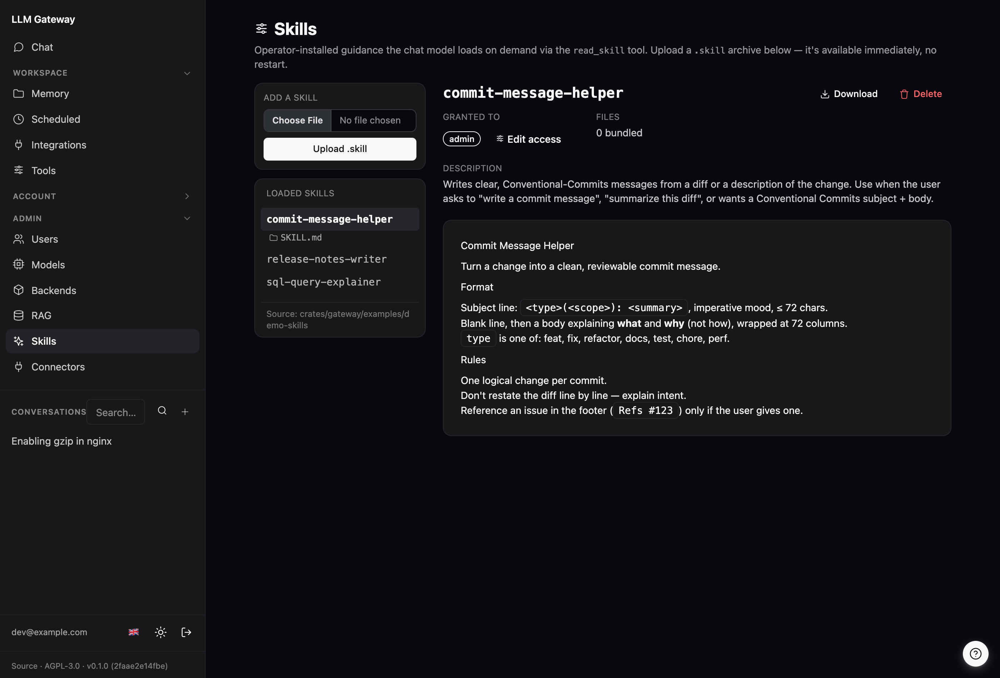

**Managing skills.** Point `[skills]` at a directory and drop bundles in:

```toml
[skills]
dir = "/var/lib/gateway/skills"   # optional; default ./data/skills
```

As an admin, open `/admin/skills` to **upload** a `.skill` archive (a zip of a `SKILL.md` bundle), **view** a skill's rendered `SKILL.md` + file tree, and **delete** one — all live, with no restart: the store re-scans the directory and hot-swaps the loaded set. RBAC gates which roles may use which skill; `read_skill` rides along automatically for any role that's been granted a skill. Grants come from two sources, unioned: each role's static `skills` list in the config (`["*"]` for all, exactly like `tools`), plus a **per-skill grant editor in the UI** — click **Granted to** on a skill to pick the roles allowed to load it. UI grants are stored in the DB and take effect immediately; config grants stay authoritative and show read-only in the dialog.

**Private user skills.** Every signed-in user gets their own private skills at `/skills` — **upload** a `.skill` archive or **write `SKILL.md` inline** in the editor. Ownership *is* the grant: a private skill needs no RBAC role and is usable only in that user's own chats, invisible to everyone else. Private skills overlay the global operator set — a private skill with the same name shadows the global one for that user. They live under `<skills.dir>/.users/<user>/` (so `[skills]` must be configured), are capped per user, and are loaded through the same `read_skill` progressive-disclosure path as global skills.

### Notifications (Web Push)

Because the UI is an installable PWA, it can push a notification when an assistant turn a user started finishes **while the app isn't focused** — useful on a phone where you fire off a long turn and lock the screen. Turns run server-side in a background worker regardless of whether a tab is attached, so the "done" ping fires even after you've closed the app.

This is **on by default and needs no setup or third-party account** — the gateway generates its own [VAPID](https://datatracker.ietf.org/doc/html/rfc8292) keypair on first boot (persisted in the DB, private half sealed under the at-rest key) and encrypts each payload end-to-end for the subscription ([RFC 8291](https://datatracker.ietf.org/doc/html/rfc8291)). The only hard requirement is that the gateway is served over **HTTPS** (localhost is exempt for dev): service workers and the Push API only run on secure origins. A user opts in per device from the **Notifications** card on `/tokens`; whether a notification is actually shown is decided in the service worker (suppressed when a focused tab already has that conversation open).

```toml
[push]
enabled = true                       # optional; default true. false turns the feature + its /api/v0/push/* endpoints off
contact = "mailto:ops@example.com"   # VAPID `sub`: a contact the push service may use to reach you (set a real one for prod)
```

Platform support: **Android/Chrome** works directly; on **iOS** Web Push requires the PWA to be *installed* to the home screen (iOS 16.4+), not just open in Safari.

## Using the gateway

**1 — Get an API token.** Sign in at `/login`, then create a `gwk_…` token on the `/tokens` page.

**2 — Call it like the OpenAI API:**

```bash
export OPENAI_API_KEY=gwk_…
export OPENAI_BASE_URL=https://gateway.example.com/v1
openai api chat_completions.create -m <model-id> -g user "Hello"
```

`GET /v1/models` lists every model the gateway has discovered across all pools — pick a `model` id from there.

**3 — Or just use the chat UI** at `/chat`: pick a model, attach files, and chat with streaming replies. Conversations persist server-side and resume on reconnect.

### HTTP endpoints

| Endpoint | Auth | Purpose |
|---|---|---|
| `POST /v1/chat/completions` | Bearer token | Chat completions (streaming + non-streaming). |
| `POST /v1/embeddings` | Bearer token | Embeddings. |
| `POST /v1/images/generations` | Bearer token | Image generation (routes to an `image`-kind pool). |
| `POST /v1/images/edits` | Bearer token | Image editing (multipart: `image` + `prompt`); routes to an `image`-kind pool. |
| `POST /v1/audio/transcriptions` | Bearer token | Whisper-style transcription (multipart upload). |
| `POST /v1/audio/speech` | Bearer token | Text-to-speech (OpenAI-shaped). Only served when a `speech` upstream pool is configured. |
| `GET /v1/models` | Bearer token | All discovered models across pools (deduplicated by id). |
| `GET /v1/sandbox/files/{run}/{filename}` | Bearer token | Download a file a sandbox run produced for the caller (scoped to your user). |
| `GET /healthz`, `GET /readyz` | none | Liveness / readiness probes. |
| `/`, `/login`, `/chat`, `/tokens`, `/tools`, `/memory`, `/scheduled`, `/webhooks`, `/integrations`, `/skills`, `/usage` | session cookie | Web UI (`/integrations` is the per-user MCP connector store; `/skills` is the per-user private-skills manager — upload a `.skill` archive or write `SKILL.md` inline, usable only in your own chats; `/webhooks` manages your inbound triggers; `/usage` shows your own request/token usage; admins get an in-page "All users" toggle). |
| `/hooks/{secret}` | secret in URL | Fire a webhook: runs the owner's saved prompt with the request body appended as an untrusted block. Accepts GET and POST; sync webhooks return the model output as a JSON envelope, async ones return `202`. |
| `/admin/users`, `/admin/groups`, `/rag`, `/admin/models`, `/admin/upstreams`, `/admin/skills`, `/admin/connectors`, `/admin/comfyui`, `/admin/limits` | admin role | Admin UI (the users page lists registered users and starts impersonation; groups maps OIDC claims onto gateway groups and sets per-group tool/skill grants — pools, RAG collections, and MCP connectors then restrict access by group; upstreams edits the pool/backend topology in the DB and hot-reloads it via "Apply changes" — the old `/admin/backends` and `/admin/pools` now redirect here; connectors curates the MCP catalog — see [`docs/connectors.md`](docs/connectors.md) for provider setup; comfyui shows the loaded ComfyUI workflow catalog with a live reload button — see [`docs/comfyui.md`](docs/comfyui.md) for the manifest format; limits sets per-global/role/user rate limits & quotas). |
| `POST /impersonate/stop` | session cookie | End an active impersonation and return to your own account. |
| `/feedback`, `/feedback/extract`, `/feedback/config` | session cookie | Feedback widget: file a GitHub issue, turn a voice transcript into structured fields, and report whether the feature is configured. Enabled by the `[feedback]` config block. |
| `/api/v0/push/config`, `/api/v0/push/subscribe`, `/api/v0/push/unsubscribe` | session cookie | Web Push (turn-complete notifications): fetch the VAPID public key + enabled flag, register a browser subscription, and forget one. Governed by the `[push]` config block. |
| `/api/v0/*` | session cookie | JSON APIs backing the UI. |

The `/v1/*` endpoints require `Authorization: Bearer gwk_…`. Client `Authorization` headers are dropped at the proxy and the configured upstream key (if any) is injected; hop-by-hop headers are filtered both ways; upstream 4xx/5xx are relayed verbatim. The UI pages use the signed session cookie minted at OIDC login.

The UI is an installable **PWA** — `/manifest.webmanifest`, `/sw.js`, `/favicon.ico`, and `/icons/*` are public (no auth). The service worker cache-firsts the immutable content-hashed `/assets/*` bundles for fast loads, network-firsts the PWA metadata/icons so their short cache headers govern freshness, passes through all streaming/API traffic without buffering, and shows a localized offline fallback page for navigations — authed HTML is never cached (it's per-user and often a streaming SSE payload). Installability requires HTTPS (localhost exempt for dev).

When `[push]` is enabled (default), the PWA can also deliver **Web Push** notifications: after a user opts in from the `/tokens` page, the service worker shows a notification when an assistant turn they started finishes while the app isn't focused. This uses a self-generated VAPID keypair (persisted, private half sealed under the at-rest key) and RFC 8291 payload encryption — no third-party push provider or account is involved beyond the browser's own push service.

## Production deployment (container + systemd)

CI builds `target/release/gateway` and publishes a runtime container image (`debian:trixie-slim` plus `git` + `ca-certificates`, which the RAG indexer needs). The binary is built outside the Dockerfile and COPYed in. To build locally:

```bash
mise run build                    # produces target/release/gateway (and fetches the typst CLI)
docker build -t gateway:dev .     # Dockerfile COPYs the release binary into the image
```

[`deploy/quadlet/`](deploy/quadlet/) ships a hardened systemd-podman Quadlet (read-only rootfs, all capabilities dropped, runs as an unprivileged uid). Its [README](deploy/quadlet/README.md) is the full walkthrough; in short:

```bash
sudo install -d -m 0750 /etc/gateway
sudo install -m 0644 deploy/quadlet/gateway.container   /etc/containers/systemd/
sudo install -m 0644 deploy/quadlet/gateway.volume      /etc/containers/systemd/
sudo install -m 0600 deploy/quadlet/gateway.example.env /etc/gateway/gateway.env
sudo install -m 0640 gateway.example.toml               /etc/gateway/config.toml
sudo $EDITOR /etc/gateway/gateway.env     # GATEWAY_SESSION_KEY, GATEWAY_OIDC_CLIENT_SECRET, …
sudo $EDITOR /etc/gateway/config.toml     # upstreams, [oidc], and DB path on the volume
sudo systemctl daemon-reload
sudo systemctl enable --now gateway.service
```

Operational notes:
- **TLS:** the unit binds `127.0.0.1:8080` — terminate HTTPS with a reverse proxy (Caddy / Traefik / nginx) in front. Set `[gateway].public_url` to the external HTTPS URL so the OIDC callback is correct, and register `<public_url>/auth/callback` as a redirect URI on your OIDC client.
- **State:** the SQLite DB + session store live in a Podman-managed named volume and survive image swaps. Point `[db].path` (and `[rag].data_dir`, if used) at that volume.
- **Updates:** Quadlet treats `Image=` as the source of truth and won't re-pull `:latest` on restart — pin a digest or a `:<git-sha>` tag in production.

### Docker Compose

For hosts running Docker rather than podman, [`deploy/compose.example.yml`](deploy/compose.example.yml) is the equivalent stack (gateway + self-hosted **Google Workspace** MCP server, plus the sandbox runner and egress proxy under the `sandbox` profile). The optional PDF OCR sidecar starts under the `ocr` profile; it requires `OCR_VLLM_BASE_URL` pointing at an Unlimited-OCR vLLM service.

All deployment-relevant docs — both methods, every component, the full Google Workspace connector setup — live in **[`deploy/README.md`](deploy/README.md)**.

## Documentation

Architecture, auth, the gateway API, tools/RBAC (plus a drift-guarded [tool inventory](docs/tools-inventory.md)), upstreams, and testing are documented in [`docs/`](docs/README.md). [`AGENTS.md`](AGENTS.md) doubles as human onboarding.

## Contributing

Contributions are welcome — see [`CONTRIBUTING.md`](CONTRIBUTING.md) for the workflow, the sign-off requirement, and the Contributor License Agreement ([`CLA.md`](CLA.md)).

## License

Licensed under the **GNU Affero General Public License v3.0** (`AGPL-3.0-only`) — see [`LICENSE`](LICENSE).

You are free to use, study, modify, and redistribute this software, including in a commercial setting. Because it is AGPL, one obligation stands out: if you run a **modified** version to provide a network service, you must offer the complete corresponding source — including your modifications — to the users of that service (AGPL §13). The UI carries a persistent "Source" link for this; operators of a modified deployment should point it at their own source via the `GATEWAY_SOURCE_URL` environment variable.

**Commercial licensing.** If the AGPL's terms don't fit your use case, a separate commercial license is available — contact croit GmbH (<info@croit.io>).

Third-party components bundled with or linked into the binary retain their own licenses; see [`NOTICE`](NOTICE).
