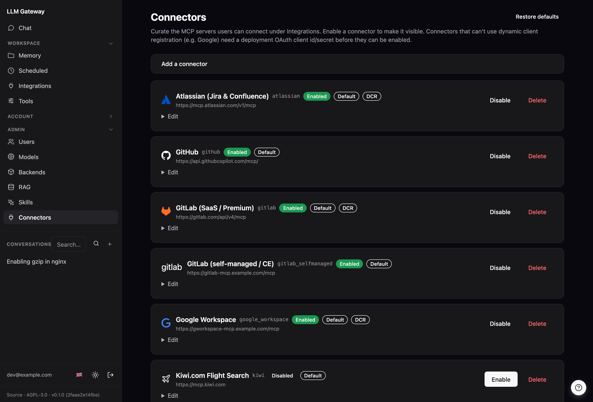

# MCP Connectors (integrations)

The gateway ships a **connector catalog**: an admin curates a list of MCP
servers (Gmail, GitHub, Atlassian, Discord, …) at `/admin/connectors`. Each
connector has a **scope**:

- **per-user** — each user connects the ones they want, with **their own**
  Google/GitHub/Atlassian account, at `/integrations`. Tokens are stored
  per-user, encrypted at rest, and refreshed in the background.
- **global** — one shared identity for the whole gateway (e.g. a Discord bot).
  No per-user sign-in: the connector is enabled by the admin and its tools are
  live for everyone the connector's role allows. See [Scope](#scope-per-user-vs-global)
  and [Discord](#discord-a-global-connector) below.



This doc is the **operator setup guide**. Connecting a server is one click for
the user, but getting a provider's OAuth app into a state where that click
works is fiddly and provider-specific. The painful parts (Google especially)
are documented here so you don't have to rediscover them.

> Tokens are encrypted with `GATEWAY_MCP_KEY` (AES-256-GCM). See the main
> [`README`](../README.md) for how the key is derived if unset. In dev with no
> key, connections don't survive a restart — users just reconnect.

## The four auth models

A catalog entry (`auth` column + `use_dcr` flag) is one of:

| Model | What the admin must do | Examples |
|---|---|---|
| **OAuth2 + DCR** (`use_dcr=true`) | **Nothing** beyond pointing it at a URL. The gateway registers itself dynamically (RFC 7591) the first time a user connects. Zero credentials to manage. | Atlassian, GitLab.com, Google Workspace (self-hosted server) |
| **OAuth2, manual client** (`use_dcr=false`) | Create an OAuth app in the provider's console, paste its **client ID + secret** into the connector. The app identity is the *gateway's*, shared by all users; each user still authorizes with their own account. | GitHub, Slack |
| **Static bearer** (`auth=static_bearer`) | Nothing in the console; the **user** pastes a personal access token when connecting. | self-hosted / on-prem MCP servers, GitLab CE |
| **None** (`auth=none`) | Nothing — just the server URL. There's no credential of any kind; each user still clicks Connect once, purely so they control whether the tools show up in their chats. | Kiwi.com flight search |

DCR is the nicest experience but most providers don't support it. Where a
provider requires a manual OAuth client, **the client ID/secret is the
gateway's app identity, not a user secret** — you set it once as admin. This is
why Claude Desktop "just works" for Google without asking you for a client ID:
Anthropic ships a pre-registered app. A self-hosted gateway has to register its
own.

The **redirect / callback URI** for every OAuth connector is:

```
https://<your-gateway-host>/integrations/callback
```

(in local dev: `http://localhost:8080/integrations/callback`). It must be
registered verbatim in the provider's OAuth app.

---

## Scope: per-user vs global

Every connector has a **scope** (the `scope` column, set on the admin form):

- **Per-user** (default) — each user connects their own account/token at
  `/integrations`; the credential and connection live per-user. This is the
  right model whenever the identity is the *user's* (Gmail, GitHub, …). All four
  auth models above apply.
- **Global** — one shared identity for the whole gateway. There is no per-user
  connection step: an admin enables the connector and its tools are immediately
  available to everyone the connector's `required_role` allows (each user can
  still set them always/ask/off on their Tools page). The connection is
  established once and shared across users. Because the identity is shared,
  **only `none` or `static_bearer` auth is allowed** — OAuth is inherently
  per-user and is rejected on save. Use `none` when the credential is baked into
  the MCP server itself (reached over a private URL, e.g. Discord), or
  `static_bearer` to store one shared token (encrypted) on the connector.

Pick global when authenticating as a single shared identity for the whole
gateway; pick per-user when each person connects their own account.

---

## Discord (a global connector)

Discord is the shipped example of a global connector: a bot token authenticates
one shared bot for the whole server, so there's no per-user Discord account to
connect. It's seeded (disabled) in the catalog. Setup is two steps — run the
sidecar bridge, then enable + point the connector at it — and is documented in
full (bot creation, intents, invite URL, running the bridge, and the loopback
URL to enter) in [`deploy/README.md`](../deploy/README.md#discord).

The connector's auth is **None** (the gateway sends no credential — the bot
token lives in the bridge container behind a private/loopback endpoint) and its
scope is **Global**. Its tools surface as `mcp__discord__*`.

---

## Google Workspace (Gmail, Calendar, Drive, Docs, …)

The single **Google Workspace** connector covers Gmail, Calendar, Drive, Docs,
Sheets, Slides, Tasks, Chat, Contacts and more — **one sign-in per user** for
every service.

> **Why not Google's own hosted MCP servers?** The endpoints
> `gmailmcp.googleapis.com` / `calendarmcp.googleapis.com` /
> `drivemcp.googleapis.com` are gated behind the **Google Workspace Developer
> Preview Program**: every tool call returns an opaque
> `The caller does not have permission` until the org's project is enrolled — a
> multi-day, manual approval that doesn't scale to per-user, multi-tenant use.
> So the gateway does **not** use them. Instead you run a **self-hosted Google
> Workspace MCP server** that talks to the **GA** Gmail/Calendar/Drive REST
> APIs. No preview, works today.

The connector is wired for **Dynamic Client Registration** — the self-hosted
server is its own OAuth 2.1 provider and holds the Google OAuth client, so the
admin only sets the server's URL in the gateway (no client id/secret to paste).
It's the same zero-credential flow as Atlassian.

**Full server setup** — the OAuth client, the exact (validated) container env,
the reverse-proxy/public-URL requirement, Quadlet + Compose units — lives in the
deployment hub: **[`../deploy/README.md`](../deploy/README.md)** → *Google
Workspace connector*. Two things worth flagging here:

- **Connector URL ends in `/mcp`** (no trailing slash; `/mcp/` 307-redirects).
- **The connector requests a default scope set** (Gmail read + compose,
  Calendar, Drive, Docs/Sheets/Slides read, Tasks). This is required: the server
  does a base-only login (`openid`+`email`) and rejects every tool call with
  *"lack required scopes"* unless the gateway asks for the service scopes up
  front. Trim the scopes on the connector for a narrower consent — changing them
  means users must disconnect + reconnect.

Each user then opens `/integrations → Google Workspace → Connect` and authorizes
once with their own Google account — no per-user setup, no preview.

---

## GitHub

GitHub's MCP server (`https://api.githubcopilot.com/mcp/`) does **not** support
dynamic registration and publishes no RFC 8414 metadata, so the gateway pins
its OAuth endpoints and you must create an app manually.

1. **GitHub → Settings → Developer settings → OAuth Apps → New OAuth App**
   (an *OAuth App*, **not** a GitHub App).
2. Authorization callback URL:
   `https://<your-gateway-host>/integrations/callback`.
3. Copy the **Client ID**, generate a **client secret**.
4. In `/admin/connectors`, edit GitHub, enter client ID + secret, save, enable.

Requested scopes: `repo`, `read:org`, `read:user`, `user:email`,
`read:project`.

---

## Slack

Slack's MCP server (`https://mcp.slack.com/mcp`) requires a **statically
registered** app — no dynamic client registration, and only
directory-published or workspace-internal apps are permitted.

1. **[api.slack.com/apps](https://api.slack.com/apps) → Create New App.**
2. Under **OAuth & Permissions**, add the redirect URI:
   `https://<your-gateway-host>/integrations/callback`.
3. Request the scopes the connector needs (search, read channels/users, send
   messages — trim to taste in `/admin/connectors`).
4. Copy the **Client ID** and **Client Secret** from **Basic Information**.
5. In `/admin/connectors`, edit Slack, enter client ID + secret, save, enable.

Each user then authorizes their own Slack account at `/integrations`. Slack
speaks streamable HTTP only — the legacy `/sse` transport isn't offered here.

---

## Atlassian (Jira & Confluence)

**Zero admin config** — Atlassian supports dynamic client registration. Just
enable the connector in `/admin/connectors`; users connect and authorize their
Atlassian site. The endpoint is the streamable-HTTP one (`/v1/mcp`); the legacy
`/v1/sse` transport is **not** supported by the gateway's MCP client.

---

## GitLab

GitLab's **native** MCP server (`/api/v4/mcp`) is a **GitLab Duo** feature that
requires **Premium/Ultimate** (and Duo enabled). There are two catalog
connectors:

- **GitLab (SaaS / Premium)** — `https://gitlab.com/api/v4/mcp`, OAuth + DCR,
  zero admin config (like Atlassian). For gitlab.com Premium/Ultimate users.
- **GitLab (self-managed / CE)** — for **Community Edition** and any
  self-managed instance, where the native MCP isn't available. Run a self-hosted
  community bridge ([`zereight/gitlab-mcp`](https://github.com/zereight/gitlab-mcp))
  in streamable-HTTP + remote-authorization mode; it forwards each request's
  bearer to GitLab as that user's **personal access token**, so it's a
  **static-bearer** connector — each user pastes their own PAT (scope `api`, or
  `read_api` for read-only). Deployment recipe (compose + Quadlet) in
  [`../deploy/README.md`](../deploy/README.md). Unlike the Google MCP this bridge
  needs **no public URL and no OAuth** — the gateway reaches it internally.

---

## Kiwi.com flight search

Kiwi's MCP server (`https://mcp.kiwi.com`) is public and unauthenticated — no
API key, no OAuth, nothing to configure. **Zero admin config**: just enable
the connector in `/admin/connectors`. Users still connect individually at
`/integrations` (there's no credential to enter — the click just opts the
tools into that user's chats).

---

## Generic / self-hosted servers (static bearer)

For any HTTP MCP server that authenticates with a bearer token (on-prem tools,
internal ERP, the GitLab CE bridge above):

1. In `/admin/connectors`, add a connector with **auth = static bearer** and the
   server's streamable-HTTP URL.
2. Each user pastes their own token when connecting at `/integrations`.

The server must actually have its MCP endpoint enabled. A `404` with a body
like `MCP integrations are not enabled on this installation` means the *server*
needs a toggle flipped — it's not a gateway problem.

---

## Troubleshooting

| Symptom | Likely cause |
|---|---|
| `The caller does not have permission` (Google) — connects fine, tool *call* fails | You're hitting Google's **hosted** MCP endpoints (`*mcp.googleapis.com`), which are gated behind the Workspace Developer Preview Program. Don't use them — point the connector at a **self-hosted** Google Workspace MCP server instead (see the Google Workspace section). On the self-hosted server, this 403 instead means the user's account lacks access to that GA API, or the API isn't enabled in the server's project. |
| `Couldn't load tools` right after connecting | Wrong endpoint transport (e.g. an `/sse` URL where the gateway needs streamable-HTTP `/mcp`), TLS/URL error, or the server rejected the token. The connector card shows the real error; check the gateway log too. |
| OAuth `missing field access_token` / token-exchange errors | The provider returned an OAuth error body instead of a token (bad client secret, wrong redirect URI, unsupported grant). The gateway surfaces the provider's `error_description`. |
| Refresh tokens die after ~7 days (Google) | App is **External + Testing**. Publish to production or switch the audience to **Internal**. |
| `MCP integrations are not enabled on this installation` (404) | Server-side: the target MCP server hasn't enabled its MCP endpoint. Not a gateway issue. |

The gateway logs each failed tool call as `tool failed tool=mcp__… error=…`
and shows the provider's error on the connector card. When a provider returns a
structured error (Google's `PERMISSION_DENIED` detail, an OAuth
`error_description`), that text is preserved end-to-end so you can act on it
without guessing.
