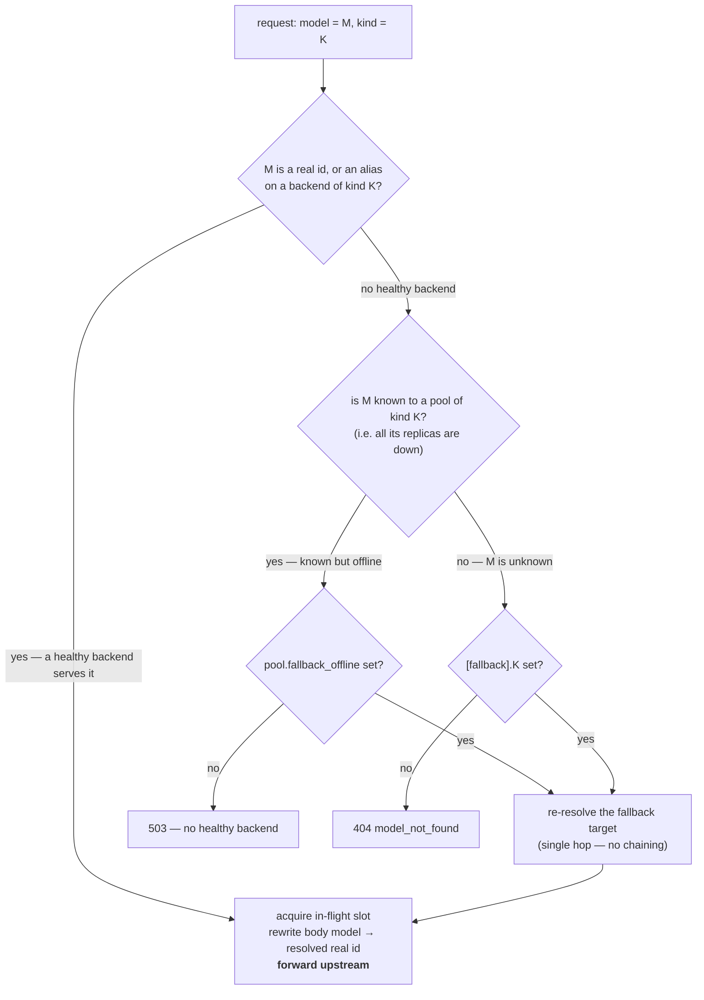

# Upstreams (multi-provider routing + load balancing)

The gateway routes each request to one of several upstream LLM backends based on the requested model name. **Routes are not declared statically** — the health probe parses each backend's `/models` response and the registry routes by what each upstream reports it serves. Load a model on a backend in the right kind of pool and it becomes routable automatically.

## Core abstraction

```text
request.model ──► [walk pools matching kind] ──► [pool whose backends advertise model]
              ──► [pool picker among healthy backends that have the model] ──► HTTP upstream
```

- A **`Backend`** is a single addressable upstream: base URL, optional API key, weight, `max_inflight`, plus a runtime-populated set of advertised model IDs.
- A **`Pool`** is an ordered set of backends sharing a `kind` (`chat` | `transcription` | `embedding`) and a picker strategy. Pools own:
    - A health-check loop per backend.
    - A picker strategy (`round_robin`, `least_inflight`). Default: `least_inflight`.
    - Implicit "what we serve" — the union of all backends' advertised-model sets.

`crates/gateway/src/server/upstreams/` owns the runtime: `config.rs` parses the TOML, `registry.rs` walks pools per request, `health.rs` runs the probe loop.

## Config shape

```toml
# gateway.toml
[upstream_pools.local_chat]
kind = "chat"
strategy = "least_inflight"

[[upstream_pools.local_chat.backend]]
name = "gpu-01"
base_url = "http://gpu-01.internal:8000/v1"
weight = 1
max_inflight = 16
# api_key_env = "BACKEND_GPU01_KEY"  # optional; for hosted providers

[[upstream_pools.local_chat.backend]]
name = "gpu-02"
base_url = "http://gpu-02.internal:8000/v1"
weight = 1
max_inflight = 16

[upstream_pools.local_whisper]
kind = "transcription"
strategy = "round_robin"

[[upstream_pools.local_whisper.backend]]
name = "whisper-01"
base_url = "http://whisper-01.internal:9000/v1"
```

No `[[models]]` table. Each backend's `/models` response is the source of truth for what it serves.

Secret material (`api_key_env`) is **only** sourced from env vars.

For the `alias`, `[fallback]`, and `fallback_offline` keys, see [Model aliases](#model-aliases) and [Fallback models](#fallback-models).

## Model discovery

Every 5 s, each backend gets a `GET <base_url>/models` probe (with the backend's bearer token, if configured). On 200 + parseable OpenAI envelope (`{"data": [{"id": ...}, ...]}`), the backend's advertised-model set is **replaced wholesale** with the names in `data[].id`. On 401 or non-parseable 200, the backend is marked alive but its model set is left as-is (so a previously-populated set survives a transient parser failure). On network error, timeout, or 5xx, the probe counts toward the unhealthy threshold.

At startup, `health::spawn` runs an initial parallel probe round and awaits it before returning, so the first request lands on a registry that already knows what each backend serves. Worst case (every backend unreachable): the gateway waits the 2 s probe timeout and starts serving with empty model sets, returning `400 invalid_request` until the looping probe populates them.

### Routing rules

When a request arrives with `model = "X"` and the handler asks for `PoolKind::Chat`:

1. Walk pools where `pool.kind == Chat`.
2. Find the first one with at least one **healthy** backend whose advertised set contains `"X"`.
3. From that pool, the picker strategy orders the candidate set; the first non-saturated backend gets an inflight slot.

If two pools of the same kind advertise the same model, the first one we iterate wins. `HashMap` iteration order isn't deterministic, so production deployments shouldn't rely on a tie-breaker — keep one pool per kind in practice.

## Model aliases

An **alias** is a stable, client-facing name that routes to a real model, decoupling *what clients ask for* from *which model is actually loaded*. The problem it solves: without aliases a client hardcodes `Qwen/Qwen2.5-72B-Instruct`; the day you load `Qwen/Qwen3-235B` instead, the old id vanishes and every connected client `404`s until it's reconfigured. Point clients at the alias `qwen`, swap the loaded model, keep the alias — and nothing downstream changes.

Aliases are declared **per backend**, inline. The same alias on several backends forms a **routing group**: a request for the alias load-balances across all of them via the normal pool picker, exactly as if they all advertised one shared model id. Both the alias *and* the real id are routable, and both appear in `/v1/models` — asking for the real id still pins that exact model.

Two forms — pick **one per backend**:

```toml
# Single-model backend (the GPU norm): a bare list.
# Each name binds to the one model this backend serves.
[[upstream_pools.local_chat.backend]]
name = "gpu-a"
base_url = "http://gpu-a:8000/v1"
alias = ["qwen", "fast"]

# Multi-model backend (e.g. a cloud provider serving many models
# behind one base_url): a map, so each alias names its target real id.
[[upstream_pools.cloud_chat.backend]]
name = "zai"
base_url = "https://api.z.ai/v1"
api_key_env = "ZAI_KEY"
alias = { smart = "glm-4.6", cheap = "glm-4.5-air" }
```

A bare-list alias needs no target because the backend serves exactly one model. The map form is **required** on multi-model backends, where a bare name couldn't tell which model it means. Both forms combine freely *across* backends into one group — list-form `qwen` on a GPU box and map-form `qwen = "glm-4.6"` on a cloud box share the same `qwen` group. A real model id always wins over an alias of the same spelling.

When a request routes through an alias the gateway **rewrites the outgoing request body's `model` field to the resolved real id** — upstreams only know their own model ids, never the alias. The response therefore reports the real model that ran, and an `X-Gateway-Resolved-Model` response header records what the alias resolved to (only when it differs from what the client sent). Admin sampling/reasoning defaults key on the **real id**, so aliases inherit them automatically — configure defaults once, under the real model name.

### Alias validation

- **At boot — refuse to start.** Statically-detectable conflicts: an alias name that collides with a real model id declared in config, or a map-form target that isn't in that backend's configured `models`. The gateway logs a clear line and exits non-zero.
- **At runtime — log + disable.** A backend's real model set is discovered from its `/models` probe, so some conflicts can't be known at boot. If a *bare* alias lands on a backend that the probe reveals serves more than one model, it's ambiguous: the gateway logs an `ERROR`, disables just that alias binding (it stops resolving and drops out of `/v1/models`), and keeps routing the backend's real ids by their own names. Detection runs when the probe updates the model set — on the transition only, not every probe.

## Fallback models

Two independent safety nets for two different failures. Both are optional; leaving them unset reproduces the previous behavior exactly (`404` / `503`).

- **`[fallback]` — unknown model (per kind).** When a request names a model that is neither a real id nor any alias, substitute a configured default *for that request kind*. Answers "the client asked for something we've never heard of" — a typo, or a model that got renamed. Unset ⇒ `404 model_not_found`.
- **`fallback_offline` — known but offline (per pool).** When a model *is* known but no healthy backend can currently serve it, spill to a backup model — typically a different tier (local GPUs down → a cloud model). Answers "we know this model, our capacity for it is just down right now." Unset ⇒ `503`.

```toml
[fallback]
chat = "qwen"                        # unknown chat model → route to "qwen"
embedding = "text-embedding-3-small"
# transcription unset → stays 404

[upstream_pools.local_chat]
kind = "chat"
fallback_offline = "glm-4.6"         # a known model in this pool going fully offline spills here
```

A fallback target is **re-resolved through the normal path**, so it may itself be an alias/group and lands on whatever healthy pool serves it. Fallback is a **single hop**: if the fallback target is *also* unavailable, the gateway returns the original `404`/`503` rather than chaining — no loops. Saturation (a healthy model whose backends are all at `max_inflight`) is **not** a fallback trigger — that stays a `503`, so a request never silently downgrades to a weaker model under mere load. Note the RAG embedding path deliberately does **not** apply `fallback_offline`: embeddings from a different model aren't comparable and would corrupt the index.

### Resolution order

The alias group is itself the first line of resilience: with `qwen` on both `gpu-a` and `gpu-b`, one backend failing still routes to the other — `fallback_offline` only fires when the *whole* group is down.



## Health checks

The same probe drives liveness *and* discovery. Three consecutive failures mark a backend `unhealthy`; one success returns to `healthy`. Unhealthy backends are skipped both for routing and for discovery (their previous model set lingers but doesn't contribute matches because the registry filters by `is_healthy()`).

For backends that don't speak OpenAI-compatible `/models`, override `health_path` per backend. The probe will still mark liveness from the HTTP status, but won't be able to register any model IDs — those backends won't appear in routing decisions unless the upstream serves OpenAI-style on the override path.

## Picking strategies

- `round_robin`: per-pool atomic counter, mod len. Skips unhealthy + non-advertising backends.
- `least_inflight` (default): track in-flight count per backend (incr on dispatch, decr on response close, including streamed responses); pick the lowest. Adapts automatically to slow backends without accurate weights.

## In-flight accounting + back-pressure

A backend's `max_inflight` is a hard cap. When all backends in a pool that advertise the requested model are at cap, the gateway returns `503` (logged at WARN). We don't queue server-side; clients re-drive.

## Streaming caveat

For streaming requests, "in-flight" lasts until the response body is fully drained. Accounting goes through the `Acquired` RAII guard returned by `acquire_for(model, kind)`.

## Transcription (Whisper-style)

`POST /v1/audio/transcriptions` accepts `multipart/form-data` with `file`, `model`, optional `language`, `prompt`, `response_format`, `temperature`. The gateway:
- Verifies auth + RBAC against the `model` field.
- Routes via `acquire_for(model, PoolKind::Transcription)` — same routing layer, same discovery path as chat.
- VAD-trims the audio and forwards the multipart body to the upstream.
- Returns the upstream response as-is.

We do **not** transcode audio in the gateway — upstreams handle the formats they support.

## Operator workflow

- Add a model on a backend → it shows up in `/v1/models` and the chat picker within 5 s.
- Drop a model → it disappears from routing within 5 s (next probe).
- Want to verify? Check `tracing` output: every model-set change logs `advertised models updated added=[...] removed=[...] total=N`.
